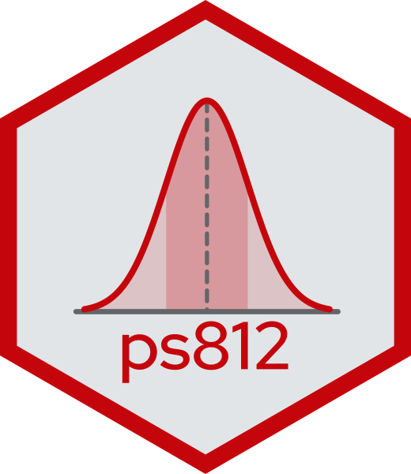

::: {.grid}

::: {.g-col-12 .g-col-sm-8 .order-2 .order-sm-1}

[Introduction to Statistical Methods in Political Science]{style="font-size: 4em; font-weight: bold;"}

[Probability, inference and regression]{style="font-size: 2em;"}

[PoliSci 812 • Fall 2026 University of Wisconsin-Madison]{style="color: grey;"}

:::

::: {.g-col-12 .g-col-sm-4 .order-1 .order-sm-2}

{.img-fluid style="max-width: 300px;"}

:::

:::

::: {.grid .course-details}

::: {.g-col-12 .g-col-sm-6 .g-col-md-4}

### Instructor

-  &nbsp; [Anton Strezhnev](https://www.antonstrezhnev.com)
-  &nbsp; North Hall 322D
-  &nbsp; [strezhnev@wisc.edu](mailto:strezhnev@wisc.edu)

### Teaching Assistant

-  &nbsp; [John Hicks](https://polisci.wisc.edu/staff/hicks-john/)
-  &nbsp; [john.hicks@wisc.edu](mailto:john.hicks@wisc.edu)

:::

::: {.g-col-12 .g-col-sm-6 .g-col-md-4}

### Course details

-  &nbsp; Tuesdays & Wednesdays
-  &nbsp; 9/8/2026 - 12/9/2026
-  &nbsp; 3:30PM-4:45PM
-  &nbsp; Ogg Room (North Hall 422)
-  &nbsp; Section: Friday 9:30AM-10:20AM, Ogg Room (North Hall 422)

:::

::: {.g-col-12 .g-col-md-4 .contact-policy}

### Contacting me

Slack is the best way to get in touch with me. My dedicated office hours are **Tuesdays 9am-11am** if you want to meet in-person. I am also generally in my office on weekdays during normal hours and my door is open, so you are welcome to drop in. You can also feel free to contact me to confirm availability or to schedule a virtual meeting via Zoom.

:::

:::
