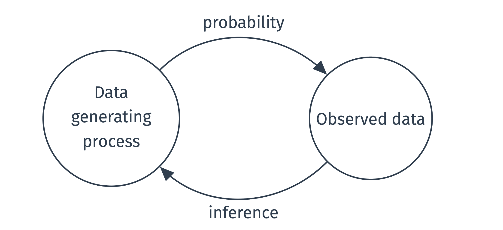
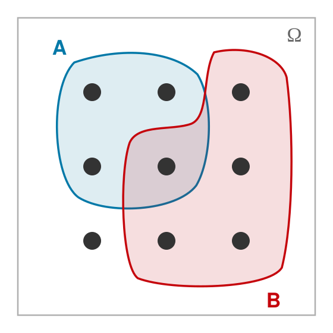
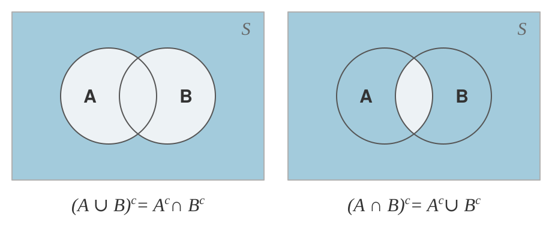

## Welcome! {.title-slide}

## Week overview

::: {.incremental}

- This week
  - **Introductions** + course logistics
  - Intro to probability
- Next week
  - Conditional probability
  - Independence
  - Bayes' rule
- Long-run
  - **probability** $\to$ inference $\to$ regression

:::

## Course Overview

::: {.incremental}

- Instructor: **Anton Strezhnev**
- TA: **John Hicks**
- Methods Mentor: **Nastya Andreeva**
- Logistics:
  - **Lectures** T/W - 3:30pm-4:45pm, Ogg Room (North Hall 422)
  - **Section** F - 9:30am-10:20am, Ogg Room (North Hall 422)
  - *5* Problem Sets (~ 2 weeks)
  - In-class midterms (October 7, November 18)
  - Replication project poster (December 4th)

:::

## Course Overview

::: {.incremental}

- **My office hours:** Tuesdays 9am-11am (North Hall 322D)
- **John's office hours:** Thursdays 9am-11am (North Hall 201D)
- **Nastya's office hours:** Fridays 10:30am-12:30pm (North Hall 315)
- **Course Website**: [https://www.antonstrezhnev.com/ps812](https://www.antonstrezhnev.com/ps812)
- Announcements will be posted on **Slack** - you should have received an invite.

:::

## Course Objectives

::: {.incremental}

- What is this course about?
  - **Probability** - How do we talk about uncertainty in a structured manner?
  - **Inference** - Given what we observe, how do we learn about what we don't?
  - **Regression** - Can we characterize the average of one quantity given information about another?
- Goals for the course
  - Critically read, interpret and evaluate quantitative social science articles
  - Conduct, interpret and communicate results from a regression analysis
  - Write clean, reusable and reliable analysis code in R
  - See how research is conducted by working with *real* replication data.

:::

## Statistical computing

::: {.incremental}

- This course will teach you how to work in the  programming language.
  - A **high-level** language designed for statistical computing
- We'll focus on the **concepts** of computing
  - (e.g. functions, data types, control structures)
  - Data cleaning/processing via `tidyverse`
  - Syntax is important...but LLMs are making memorization less necessary.
- Scientific publishing in **Quarto**
- More broadly, I want you to learn how your **computers** work for research
  - Kieran Healy's [**Modern Plain Text Computing**](https://mptc.io/) [@healy2025mptc]

:::

## Course workflow

::: {.incremental}

- **Lectures** (Tuesdays/Wednesdays)
  - One set of slides for each of the two lectures in each week
  - Your primary point of instruction - goal is to **synthesize** the core material + give you the tools to learn more.
  - I want lectures to be **interactive** - you should ask questions and interrupt!
- **Section** (Fridays)
  - Meets once a week - this is where we do the **computing**.
  - Starts with questions and review, then short **guided exercises** in R.
  - Bring your laptop and bring your problem set questions!

:::

## Course workflow

::: {.incremental}

- **Readings**
  - Core textbook: **Foundations of Agnostic Statistics** [@aronow2019foundations]
  - Supplemental:
    - **A User's Guide to Statistical Inference and Regression** [@blackwell2025users]
    - **Introduction to Probability** [@blitzstein2019introduction]
  - Various papers from political science and adjacent disciplines are assigned throughout.
  - Everything is available digitally either directly or through the UW-Madison online library resources
  - Do the readings prior to each week, but definitely be sure to do them before the Wednesday.

:::

## Course workflow

::: {.incremental}

- **Problem sets** (20% of your grade)
  - *Five* problem sets, each covering roughly a two-week block of material.
  - Main day-to-day component of the class -- meant to get you working with your colleagues and
  thinking hard about the material.
  - Collaboration is **strongly encouraged** -- you should ask and answer questions on our class
  **Slack Discussion** board
  - Submit on the **Gradescope** assignment platform
  - Grading is on a **plus/check/minus** scale.
    - Conversion to grade point is somewhat holistic.
    - Majority plusses is an A, Majority checks is an AB, Majority minus is a B
  - Solutions will be posted to Canvas after the due-date.

:::

## Course workflow

::: {.incremental}

- **Two in-class midterms** (20% of your grade each)
  - **October 7** -- the first five weeks of probability theory.
  - **November 18** -- statistical inference and linear regression.
  - Closed-book, pen-and-paper - similar format to comprehensive exams
- **Replication project** (30% of your grade)
  - Work in groups of 2-3 to replicate and extend a published paper.
  - Presented as a **poster** at the MEAD grad poster session, **December 4th**.
  - An ungraded check-in memo is due **October 21**
- **Participation** (10% of your grade)
  - It is important that you actively engage with lecture, section, and the teaching staff -- ask and answer questions.
  - Participating on Slack counts as well, as does attending MEAD talks.

:::

## Course workflow

::: {.incremental}

- **Models, Experiments and Data workshop**
  - Check out the Fall 2026 schedule here: [https://sites.google.com/view/meadwisc/home](https://sites.google.com/view/meadwisc/home)
- Get added to the Slack workspace:
  - [https://join.slack.com/t/modelsanddata/shared_invite/zt-3cfv6l4lv-4XVF2V_toX_B0qQce55vCg](https://join.slack.com/t/modelsanddata/shared_invite/zt-3cfv6l4lv-4XVF2V_toX_B0qQce55vCg)

:::

## Class Requirements

::: {.incremental}

- **Overall**: An interest in learning and willingness to ask questions.
- No formal pre-requisites - Math camp should get you up to speed on topics/refresh your memory of HS math.
  - We'll spend time on the really relevant stuff: probability/inference 
- Math is not about intrinsic aptitude, it's about **effort**

  > ...in mathematics you don't understand things. You just get used to them.
  >
  > --- John Von Neumann

- We don't do rigor for rigor's sake
  - But rigor is *important* - we will tell you *why* we need to be clear and precise about things!
- You're developing your ability to *reason* and not just *memorize*
- If you're unsure or confused, always **ask** - we will match the effort you put in 
- We all come from different backgrounds. Please have patience with **yourself** and with **others**

:::

## LLM Policy

::: {.incremental}

- See the syllabus for the long-winded write-up
- In short...
  - You should have LLMs **do** things for you
  - You should not have LLMs **think** for you
  - You should *definitely* not have LLMs **speak** for you
- Sometimes it's valuable to *not* have the LLM **do** a think so that you can learn to **think**.
  - Try to minimize use on the problem sets.
  - The exams are ultimately the check on this...
  - ...as is the poster session.

:::

## Acknowledgements

::: {.incremental}

- First and foremost, this course is indebted to **Adeline Lo** who taught it for the last several years and has provided a wealth of materials.

- But it's also an iteration in the broader project of methods education in **political methodology** and is indebted to many of those who have taught versions of this course in the past and at other institutions
  - Matthew Blackwell, P Aronow, Adam Glynn, Justin Grimmer, Jens Hainmueller, Erin Hartman, Chad Hazlett, Kosuke Imai, Gary King, Dean Knox, Kevin Quinn, Molly Roberts, Molly Offer-Westort, Brandon Stewart, and Teppei Yamamoto

:::

## A brief overview

::: {.incremental}

- **Weeks 1-2:** Probability, conditional probability and independence
- **Weeks 3-5:** Random variables, distributions, expectation, variance and covariance
  - *First midterm: Wednesday, October 7*
- **Weeks 6-7:** Estimation - bias, variance, consistency and the central limit theorem
- **Week 8:** Confidence intervals and hypothesis testing
- **Weeks 9-11:** Linear regression - estimation, inference and interpretation
  - *Second midterm: Wednesday, November 18*
- **Week 12:** Regression wrap-up - polynomials, overfitting and penalized regression
- **Week 13:** Weighting estimators - missing data, IPW and survey weights
- **Week 14:** A preview of causal inference (and of PS 813)

:::

## Statistics and Political Science

::: {.incremental}

- **Statistics** is an *extremely* recent field - hypothesis testing formalized in early 20th C
  - **Probability** a bit older - 17th/18th century.
- Early applied statistics mostly in medicine/biological sciences - **biostatistics**
- In the social sciences, **econometrics** becomes a distinct discipline around the 1930s
- **Political methodology** starts to define itself as a separate field around 1984 (first PolMeth meeting)
- What is **political methodology**?
  - A messy blend of all of these + computer science!

:::

## What is Statistics?

::: {.incremental}

- How do we take something that **we know** and use it to learn about what we **do not know**?
  - How do we quantify our **uncertainty** around our **predictions**? 

- Our main tools are **assumptions** about the **data-generating process**
  - If we assume that the thing **we know** came from some *known* process connected to the thing we don't know...
  - ... then we can draw **inferences** about what we don't know!

:::

## Agnostic Statistics

::: {.incremental}

- Traditional education in statistics often starts from **very strong** modeling assumptions
  - (e.g. outcomes are known to be *normally distributed*)
- This may work for some fields, but not the **social sciences**
  - Our models are **wrong** - they're analytical tools
- If we make assumptions, we want them rooted in *substantive knowledge*.
  - (e.g. randomization of a treatment)
- Otherwise, we want to be as **agnostic** as possible.

:::

## Probability and Inference

{fig-align="center" width="85%"}

::: {.attribution}
Figure from @blackwell2025users, Ch. 2
:::

## Interpreting probability

::: {.incremental}

- **Probability** allows us to quantify how *likely* an event would be under a given data-generating process
  - **Objectivist** interpretation: probabilities are **long-run frequencies**
  - **Subjectivist** interpretation: probabilities are **degrees of belief**
- To talk about *probability*, we first need to talk about *events*

:::

## Sample space

:::: {.incremental}

- Define the **sample space** $\mathcal{S}$ as the set of all possible outcomes of an "experiment"

::: {.fragment}
{fig-align="center" width="40%"}

::: {.attribution}
After @blitzstein2019introduction, Figure 1.1
:::
:::

::::

## Events

::: {.incremental}

- An **event** is a **subset** of the sample space (including the empty set)
  - Let $\mathcal{F}$ be the set of all events (that can be assigned a probability) 

::: {.fragment}
{fig-align="center" width="40%"}
:::

- Probability is a function that maps from $\mathcal{F}$ to the interval $[0,1]$
  - $P \colon \mathcal{F} \to [0, 1]$

:::

## Set review

::: {.incremental}

- The empty set $\emptyset$ is the set that contains no elements
- The **complement** of a set $A$, denoted $A^{c}$, is the set of all elements not in $A$
  - Implicitly complements are defined w.r.t. some "universal" set - here the sample space $\mathcal{S}$.
  - What's $\mathcal{S}^c$?

- Practice: In the figure below, is $A^{c} = B$?

::: {.fragment}
{fig-align="center" width="40%"}
:::

:::

## Set review

::: {.incremental}

- The **union** of two events $A \cup B$ contains all elements in **either** $A$ **or** $B$
  - We'll sometimes use a $\bigcup_i$ to denote a union over *many* events 
- The **intersection** of two events $A \cap B$ contains all elements **both** in $A$ **and** $B$
- Two sets $A$ and $B$ are **disjoint** or **mutually** exclusive if $A \cap B = \emptyset$

- Practice: Are $A$ and $B$ below disjoint?

::: {.fragment}
{fig-align="center" width="40%"}
:::

:::

## Set review

:::: {.incremental}

- **De Morgan's Law**:
  - $(A \cup B)^{c} = A^{c} \cap B^{c}$ -- *not in either* means *in neither*
  - $(A \cap B)^{c} = A^{c} \cup B^{c}$ -- *not in both* means *missing from at least one*
  - Extension to  many events: $\left(\bigcup_i A_i\right)^{c} = \bigcap_i A_i^{c}$

::: {.fragment}
{fig-align="center" width="78%"}
:::

::::

## Probability axioms

::: {.incremental}

- The probability function $P$ obeys three axioms (*Kolmogorov's Axioms*)

  1) **Non-negativity**: $P(A) \geq 0$ for every event $A \in \mathcal{F}$
  2) **Normalization**: $P(\mathcal{S}) = 1$
  3) **Countable additivity**: for *pairwise disjoint* events $A_1, A_2, A_3, \dotsc$

     $$P\left(\bigcup_{i=1}^{\infty} A_i\right) = \sum_{i=1}^{\infty} P(A_i)$$

:::

## Conjunctions

- @tversky1983extensional gave this question to a sample of undergraduate students:

::: {.fragment}

> A health survey was conducted in a representative sample of adult males in
> British Columbia of all ages and occupations. Mr. F. was included in the
> sample. He was selected by chance from the list of participants.
>
> Which of the following statements is more probable? (check one)
>
> 1. Mr. F. has had one or more heart attacks.
> 2. Mr. F. has had one or more heart attacks and he is over 55 years old.

:::

::: {.fragment}

- $58\%$ of respondents **incorrectly** said the **second** option

:::

## The Union Rule

::: {.incremental}

- The probability of a **union** of two events is the **sum** of their respective probabilities minus the probability of their **intersection**

  $$ P(A \cup B) = P(A) + P(B) - P(A \cap B) $$
- **Proof**
  - Split both $A \cup B$ and $B$ into **disjoint** pieces using $A$ and $A^{c}$

    $$A \cup B = A \cup (B \cap A^{c}) \qquad\qquad B = (A \cap B) \cup (B \cap A^{c})$$

  - **Additivity** turns each union into a sum

    $$P(A \cup B) = P(A) + P(B \cap A^{c}) \qquad P(B) = P(A \cap B) + P(B \cap A^{c})$$

  - Solve the second for $P(B \cap A^{c}) = P(B) - P(A \cap B)$, then substitute into the first.

:::

## Bounding the probability of an intersection

::: {.incremental}

- Rearrange the **union rule** to put the intersection on its own

  $$P(A \cap B) = P(A) + P(B) - P(A \cup B)$$

- From earlier, we can split the union into disjoint parts: $P(A \cup B) = P(A) + P(B \cap A^{c})$
  - **Non-negativity** of $P(B \cap A^{c})$ bounds the union from below

    $$P(A \cup B) \geq P(A) \qquad\qquad P(A \cup B) \geq P(B)$$
- Substituting $P(A \cup B) \geq P(B)$ gives $P(A \cap B) \leq P(A)$
- Substituting $P(A \cup B) \geq P(A)$ gives $P(A \cap B) \leq P(B)$
- Both hold at once, so the intersection is bounded by the *smaller* of the two

  $$P(A \cap B) \leq \min\{P(A),\, P(B)\}$$

:::

## Fréchet inequalities

::: {.incremental}

- For *any* two events $A, B$, their **intersection** is bounded by

  $$\max\{0,\, P(A) + P(B) - 1\} \;\leq\; P(A \cap B) \;\leq\; \min\{P(A),\, P(B)\}$$
- For *any* two events $A, B$, their **union** is bounded by

  $$\max\{P(A),\, P(B)\} \;\leq\; P(A \cup B) \;\leq\; \min\{1,\, P(A) + P(B)\}$$

:::

## References {.refs-slide}

::: {#refs}
:::
