## Welcome back! {.title-slide}

<!-- MathJax macros for the whole deck. The reveal math plugin overwrites
     window.MathJax, so a header config would be clobbered; defining them in
     the first slide registers them before any later slide is typeset. The
     wrapper takes up no space and renders nothing. -->
::: {style="position:absolute;width:0;height:0;overflow:hidden;opacity:0"}
$$
\newcommand{\indep}{\mathrel{\perp\mkern-10mu\perp}}
\newcommand{\nindep}{\mathrel{\rlap{\hspace{0.30em}/}{\perp\mkern-10mu\perp}}}
$$
:::

## Week overview

::: {.incremental}

- Last week
  - Sample spaces, events and the probability measure
  - The axioms of probability and their implications
- This week
  - **Conditional probability** 
  - **Independence** and **conditional independence**
  - **Bayes' rule**
- Long-run
  - probability $\to$ inference $\to$ regression

:::

## Probability as counting

::: {.incremental}

- When all **outcomes** in the **sample space** $\Omega$ are equally likely and the sample space is **finite**...
  - ...the probability of some event $A$ is just the share of outcomes in $\Omega$ that fall into $A$
  - This is the **naive definition of probability** [@blitzstein2019introduction]

  $$ P(A) =  \frac{\text{number of outcomes contained in } A}{\text{number of outcomes in } \Omega} $$

- This turns calculating a **probability** into a **combinatorics** exercise
  - We just need to count!

:::

## Ways of counting

::: {.incremental}

- **Multiplication rule**
  - If two separate experiments $A$ and $B$ have $a$ and $b$ possible outcomes respectively...
  - ...then the total number possible outcomes in the **compound** experiment is $a \times b$
- **Sampling with replacement**
  - If I sample $k$ elements from a total of $n$ **with replacement** and **order matters**, the total number of possibilities is $n^k$
  - Applying the *multiplication rule* across $k$ identical sub-experiments

:::

## Ways of counting

::: {.incremental}

- **Sampling without replacement**
  - If I sample $k$ elements from a total of $n$ **without replacement** and **order matters**, the number of possible outcomes changes for each "trial"
  - $n \times (n-1) \times (n-2) \dotsc (n - k + 1) = \frac{n!}{(n-k)!}$
- **Permutations**
  - A *permutation* of $n$ items is equivalent to sampling $n$ elements **without replacement** where **order matters**
  - $n \times (n-1) \times (n-2) \dotsc 1 = n!$

:::

## Ways of counting

::: {.incremental}

- **Sampling without replacement** where **order doesn't matter**
  - When order doesn't matter, we need to adjust for *overcounting* permutations of size $k$

    $$ {n \choose k} = \frac{n!}{(n-k)!k!} $$

  - This is known as the **binomial coefficient** and shows up in many areas of mathematics (you'll see it in the Binomial PMF later!)
  - Another place is **Pascal's triangle** - each element is the binomial coefficient $\text{row} \choose \text{column}$
    $$
    \begin{array}{ccccccccc}
      &   &   &   & 1 &   &   &   &   \\
      &   &   & 1 &   & 1 &   &   &   \\
      &   & 1 &   & 2 &   & 1 &   &   \\
      & 1 &   & 3 &   & 3 &   & 1 &   \\
    1 &   & 4 &   & 6 &   & 4 &   & 1
    \end{array}
    $$

:::

## Ways of counting

::: {.incremental}

- **Sampling with replacement** where **order doesn't matter**
  - This is a harder problem (and less common)! We'll try to define it in an *equivalent* way that lets us use what we already know.
  - Imagine instead we want to count how many ways to put $k$ **identical** objects in $n$ **distinguishable** boxes

  <svg viewBox="0 0 900 192" role="img" aria-label="A row of five dots separated by three dividers, bracketed as eight symbols in a row." font-family="Red Hat Text, sans-serif" style="width:100%;max-width:800px;height:auto;display:block;margin:0 auto;"><text x="450" y="26" text-anchor="middle" font-size="25" fill="#333333">n = 4 boxes, k = 5 identical objects</text><g fill="#333333"><circle cx="205" cy="88" r="16"/><circle cx="275" cy="88" r="16"/><circle cx="415" cy="88" r="16"/><circle cx="625" cy="88" r="16"/><circle cx="695" cy="88" r="16"/></g><g stroke="#c5050c" stroke-width="7" stroke-linecap="round"><line x1="345" y1="52" x2="345" y2="124"/><line x1="485" y1="52" x2="485" y2="124"/><line x1="555" y1="52" x2="555" y2="124"/></g><path d="M170 140 L170 149 L730 149 L730 140" stroke="#888888" stroke-width="2" fill="none"/><text x="450" y="184" text-anchor="middle" font-size="24"><tspan fill="#333333">n + k &#8722; 1 = 8 symbols: </tspan><tspan fill="#333333" font-weight="600">k = 5 dots</tspan><tspan fill="#666666"> and </tspan><tspan fill="#c5050c" font-weight="600">n &#8722; 1 = 3 dividers</tspan></text></svg>

  - We have $n + k - 1$ "slots" in between the outer dividers
    - We just need to select the location of the $k$ objects, then the dividers fill in the rest.
  - So the number of possibilities is

    $$ {n + k - 1 \choose k} = \frac{(n + k - 1)!}{(n-1)!k!} $$ 
:::

## Practice: The Birthday Problem

::: {.incremental}

- What is the probability that in a room of $k$ people, at least two people will be born on the same day.
  - Assume no leap years and equal probability of being born on any day.

- $Pr(\text{Any two of } k \text{ people share a birthday})$ is hard to work with. 
  - We'll instead calculate the **complement**: $Pr(\text{All } k \text{ people born on different days})$ and subtract from $1$.

- **Denominator**: Sampling **with replacement** from the set of birthdays where **order matters**
- **Numerator**: Sampling **without replacement** from the set of birthdays where **order matters**

:::

## Practice: The Birthday Problem

- So we can calculate the probability as

  $$ Pr(\text{Any two of } k \text{ people share a birthday}) = 1 - \frac{\frac{365!}{(365-k)!}}{365^k} $$

- How quickly does this hit $1$?

```{r}
#| echo: false
#| fig-width: 8
#| fig-height: 3.1
#| fig-align: center

library(ggplot2)

k <- 1:100
p <- sapply(k, function(n) 1 - prod((365 - seq_len(n) + 1) / 365))

ggplot(data.frame(k = k, p = p), aes(k, p)) +
  geom_line(linewidth = 1.1, colour = "#c5050c") +
  scale_x_continuous(limits = c(0, 100), expand = c(0, 0)) +
  scale_y_continuous(limits = c(0, 1), expand = c(0, 0)) +
  labs(x = "Number of people in a room",
       y = "Probability that at least\ntwo people share a birthday") +
  theme_minimal(base_size = 13) +
  theme(panel.grid.minor = element_blank(),
        plot.background = element_rect(fill = "#F7F7F7", colour = NA),
        panel.background = element_rect(fill = "#F7F7F7", colour = NA))
```

- The probability of any one coincidence is **low** but the probability of **some** coincidence is **high**!


## When the naive definition fails

::: {.app-frame .video-frame data-app="https://www.youtube.com/embed/lalvQQoFvBA" data-title="It's going to either happen or it's not - best guess is 1 in 2" data-allow="accelerometer; clipboard-write; encrypted-media; gyroscope; picture-in-picture; web-share" data-fullscreen="1"}
:::


## Conditional probability

::: {.incremental}

- So far we've talked about the probability of **single events**
  - We've created new events by taking **unions** $\cup$ and **intersections** $\cap$

- But very often we want to know how the probability of **one event** $A$ changes if another event $B$ is **known** to have occurred (assuming that event *can* occur: $P(B) > 0$)
  - This is a **conditional probability**

  $$ P(A \mid B) = \frac{P(A \cap B)}{P(B)} $$

  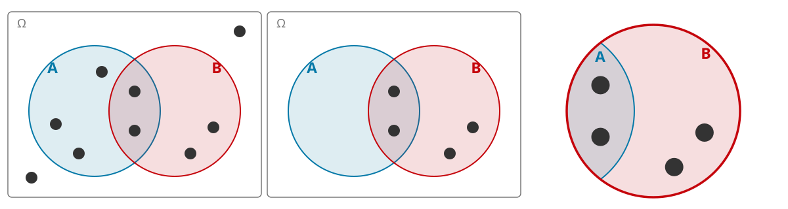{fig-align="center" width="90%"}

:::

## Conditional probability and party ID {.app-slide}

::: {.app-frame data-app="ces_conditioning_app.html"}
:::

::: {.attribution}
CES Common Content 2025 (n = 17,000), weighted by `commonweight`
:::

```{=html}
<script>
// The widget is a separate page framed here. Its <iframe> is built at runtime
// rather than written into the markdown because `embed-resources: true` would
// otherwise inline the target into a data: URI, breaking the app's relative
// asset paths and its service worker. Mounting on first visit to the slide
// also keeps the webR runtime from downloading until it is actually needed.
(function () {
  function mount(el) {
    if (el.dataset.mounted) return;
    el.dataset.mounted = "1";
    var f = document.createElement("iframe");
    f.src = el.dataset.app;
    f.title = el.dataset.title || "Conditioning on policy preferences";
    f.setAttribute("allow", el.dataset.allow || "clipboard-write");
    if (el.dataset.fullscreen) f.setAttribute("allowfullscreen", "");
    el.appendChild(f);
  }
  function check() {
    document.querySelectorAll(".app-frame[data-app]").forEach(function (el) {
      if (el.closest("section.present")) mount(el);
    });
  }
  function wire() {
    if (!window.Reveal) { check(); return; }
    if (typeof Reveal.on === "function") Reveal.on("slidechanged", check);
    check();
  }
  if (document.readyState === "complete" || document.readyState === "interactive") {
    setTimeout(wire, 0);
  } else {
    document.addEventListener("DOMContentLoaded", wire);
  }
  window.addEventListener("load", check);
})();
</script>
```

## Factoring into conditional probabilities

::: {.incremental}

- From our definition of conditional probability, we also have a way of **factoring** any joint probability into a product of conditionals

  $$ P(A \cap B) = P(A \mid B) P(B) = P(B \mid A) P(A) $$

- We can extend this to any intersection of $n$ events - and in fact there are $n!$ different factorizations

  $$ P(A_1 , A_2, A_3, \dotsc A_n) = P(A_{n} \mid A_{n-1}, \dotsc A_{1})\cdots P(A_3 \mid A_2, A_1)P(A_2 \mid A_1)P(A_1)$$

  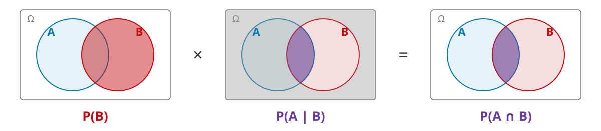{fig-align="center" width="88%"}

:::

## Law of Total Probability

::: {.incremental}

- Can we decompose the **unconditional** probability of some event $B$ into conditional probabilities?
- Let $A_1, A_2, A_3, \dotsc A_n$ be a set of **disjoint** events that partition the sample space $\Omega$
- We can write $B$ as the union of the disjoint sets intersecting $B$ with each piece $A_1, A_2, \dotsc A_n$

  $$ B = (B \cap A_1) \cup (B \cap A_2) \cup \cdots \cup (B \cap A_n) $$

- Then we apply additivity

    $$ P(B) = P(B \cap A_1) + P(B \cap A_2) + \cdots + P(B \cap A_n) $$

- Then plug in our factorization of the joint

    $$ P(B) = P(B \mid A_1)P(A_1) + P(B \mid A_2)P(A_2) + \cdots + P(B \mid A_n)P(A_n) $$
:::

## Law of Total Probability

- This gives us the **law of total probability**

  $$ P(B) = \sum_{i=1}^n P(B \mid A_i)P(A_i) $$

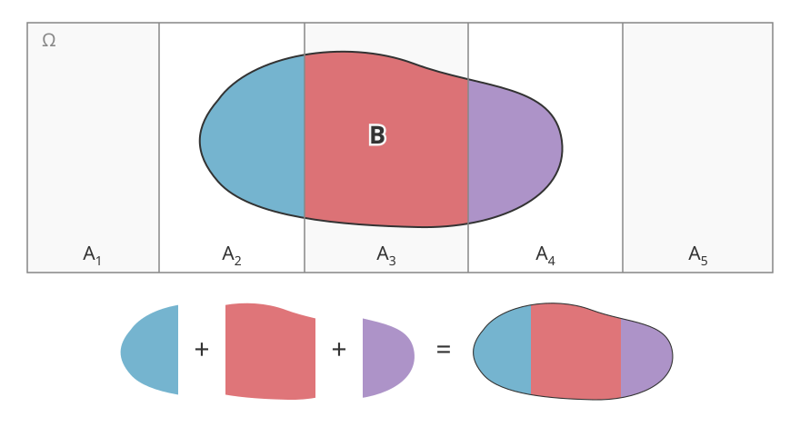{fig-align="center" width="72%"}


## Bayes' rule

::: {.incremental}

- Going back to our two equivalent expressions for $P(A \cap B)$

  $$ P(A \mid B) P(B) = P(B \mid A) P(A) $$

- Dividing both sides by $P(B)$ gives us a formula for relating one conditional probability to another: **Bayes' rule**

  $$ P(A \mid B) = \frac{P(B \mid A) P(A)}{P(B)} $$

- You'll sometimes see this written with **law of total probability** applied to the denominator

  $$ P(A \mid B) = \frac{P(B \mid A) P(A)}{P(B \mid A) P(A) + P(B \mid A^c)P(A^c)} $$

:::

## Bayes' rule

::: {.incremental}

$$ P(A \mid B) = \frac{P(B \mid A) P(A)}{P(B)} $$

- We'll often use Bayes' rule in the context of using **new information** to **update** our beliefs about the probability of a particular event.
  - $P(A)$ is our **prior probability** of event $A$
  - $P(A \mid B)$ is our **posterior probability** of event $A$ once we know that $B$ has occurred.

- To get from **prior** to **posterior** we multiply by the factor $P(B \mid A)/P(B)$

:::

## Visualizing Bayes' rule

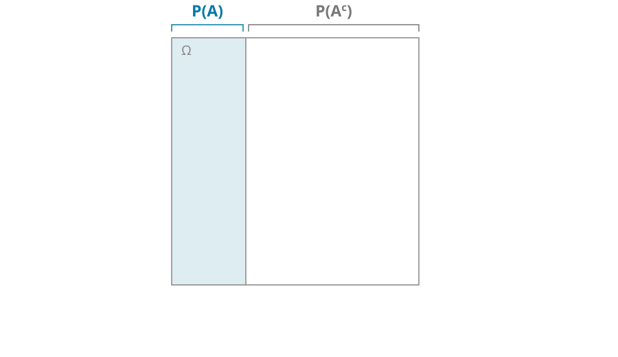{fig-align="center" width="82%"}

## Visualizing Bayes' rule

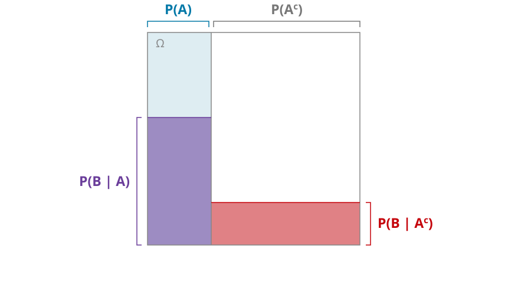{fig-align="center" width="82%"}

## Visualizing Bayes' rule

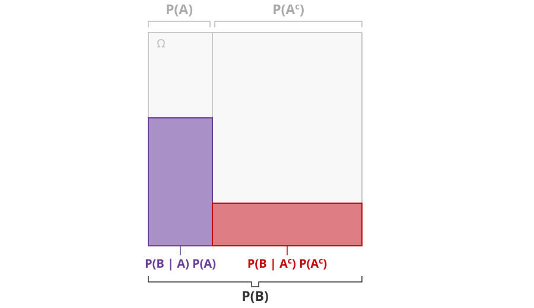{fig-align="center" width="82%"}

## Visualizing Bayes' rule

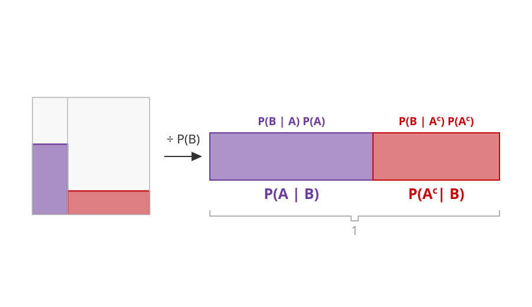{fig-align="center" width="82%"}

## The Monty Hall Problem

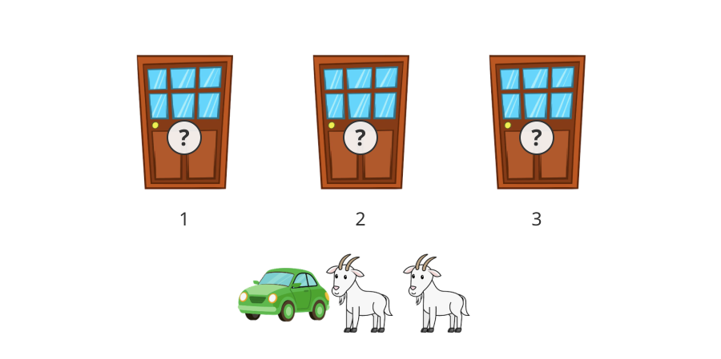{fig-align="center" width="82%"}

## The Monty Hall Problem

::: {.incremental}

- You picked the first door, the host revealed **a goat** behind the third door
- We want to know the probability that you picked the **car** given that the game show host revealed a **goat** behind door number 3.
  - We can solve this with an application of **Bayes' rule**

  $$ P(\text{car}_1 \mid \text{goat}_3) = \frac{P(\text{goat}_3 \mid \text{car}_1)}{P(\text{goat}_3)}P(\text{car}_1) $$

- Substituting in what we know

  $$ P(\text{car}_1 \mid \text{goat}_3) = \frac{\frac{1}{2}}{P(\text{goat}_3)} \cdot \frac{1}{3} $$

:::

## The Monty Hall Problem

::: {.incremental}

- For the denominator, we'll use the law of total probability and consider all possible locations of the car.

  $$ P(\text{car}_1 \mid \text{goat}_3) = \frac{\frac{1}{2}}{P(\text{goat}_3 \mid \text{car}_1)P(\text{car}_1) + P(\text{goat}_3 \mid \text{car}_2)P(\text{car}_2) + P(\text{goat}_3 \mid \text{car}_3)P(\text{car}_3)} \cdot \frac{1}{3} $$

- The host **always** opens 3 if the car is behind 2 and **never** opens 3 if the car is behind 3, so we have

  $$ P(\text{car}_1 \mid \text{goat}_3) = \frac{\frac{1}{2}}{\frac{1}{2}\cdot\frac{1}{3} + 1\cdot \frac{1}{3} + 0 \cdot \frac{1}{3}} \cdot \frac{1}{3} $$

- Therefore 

  $$ P(\text{car}_1 \mid \text{goat}_3) = \frac{\frac{1}{2} \cdot \frac{1}{3} }{\frac{1}{2}} = \frac{1}{3} $$

:::

## The Monty Hall Problem

::: {.incremental}

- Staying with door 1 still leaves you with $\frac{1}{3}$ probability of winning the car.
- The three cases partition the sample space, so their **conditional** probabilities sum to $1$

  $$ P(\text{car}_2 \mid \text{goat}_3) = 1 - P(\text{car}_1 \mid \text{goat}_3) - P(\text{car}_3 \mid \text{goat}_3) = 1 - \frac{1}{3} - 0 = \frac{2}{3} $$

- Switching doubles your chances of winning!

:::

## The Monty Hall Problem

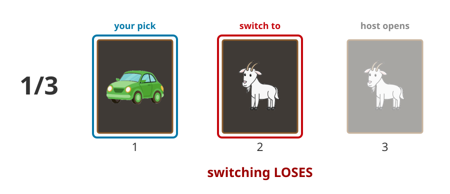{fig-align="center" width="90%"}

## The Monty Hall Problem

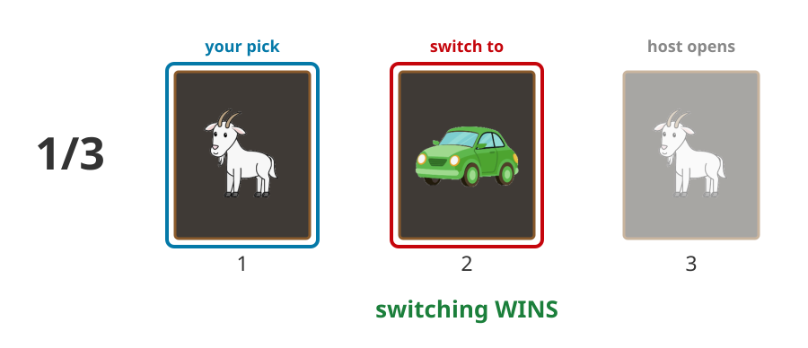{fig-align="center" width="90%"}

## The Monty Hall Problem

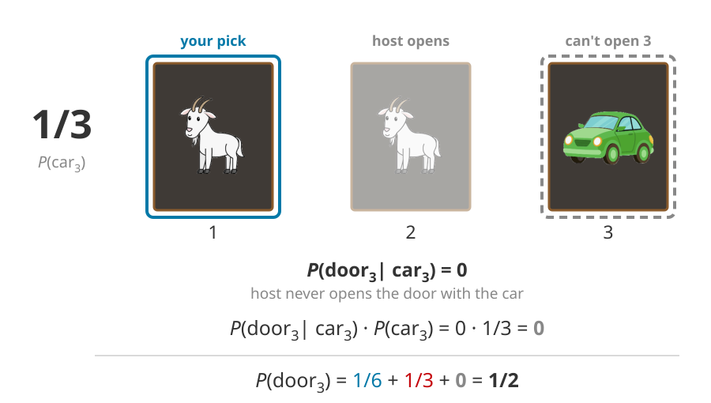{fig-align="center" width="90%"}

## The Monty Hall Problem

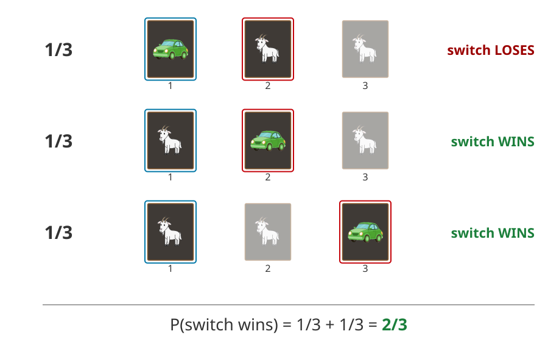{fig-align="center" width="68%"}

## Independence

::: {.incremental}

- If $A$ and $B$ are independent, the **joint probability** factors into the product of the **marginal probabilities**

  $$ P(A \cap B) = P(A)P(B) $$

- From our earlier factorization, independence (and $P(B) > 0$) implies that...

  $$ P(A \mid B) = P(A) $$

- **Intuitively**: Knowing that $B$ happened tells me *nothing* about the probability of $A$ (and vice-versa)
  - We'll write "independence" using the $\indep$ symbol

:::

## Conditional Independence

::: {.incremental}

- Independence extends to **conditioning** on some third event $C$

  $$ A \indep B \mid C \iff P(A, B \mid C) = P(A \mid C)P(B \mid C) $$

- **Intuitively**: Knowing that $B$ happened tells me *nothing* about the probability of $A$ **once I have accounted for** $C$
  
- Conditional independence does not imply independence
  - Conditioning on a **common cause** can create conditional independence between two dependent events.

- **Example**: A classic paper by @fearon2003ethnicity argues that the observed association between **conflict** and **ethnic/religious diversity** post-1960 goes away when conditioning for a third variable: **economic development**.

:::

## Independence does not imply conditional independence

::: {.incremental}

- A very tricky feature of conditioning is that we can **create dependence** by conditioning on certain events
  - A common setting is conditioning on **common effects** - this is known as **collider bias** in causal inference.

- **Example**: How knowing the grass is wet creates a relationship between your sprinkler and the rain.
  - Let $R$ be the event that it rained today. 
  - Let $S$ be the event that the lawn sprinkler turned on today. 
  - Let $W$ be the event that the grass is wet.
  - Assume $P(R) = \frac{1}{2}$ and $P(S) = \frac{1}{2}$. $S \indep R$

- Suppose I know that the grass is wet. Is $S \indep R \mid W$?

:::

## Independence does not imply conditional independence

- The grass is wet if it rained **or** the sprinkler went on: $W = R \cup S$
  - By independence, each of the four combinations of $R$ and $S$ has probability $\frac{1}{4}$

::: {.outcome-table}

|  Rain   | Sprinkler | Wet grass |  Probability  |
|:-------:|:---------:|:---------:|:-------------:|
|  $R$    |   $S$     |   $W$     | $\frac{1}{4}$ |
|  $R$    |   $S^c$   |   $W$     | $\frac{1}{4}$ |
|  $R^c$  |   $S$     |   $W$     | $\frac{1}{4}$ |
|  $R^c$  |   $S^c$   |   $W^c$   | $\frac{1}{4}$ |

:::

- Conditioning on $W$ **discards** the bottom row and renormalizes


## Independence does not imply conditional independence

::: {.incremental}

- Rain always makes the grass wet, so $P(R \cap W) = P(R)$.

  $$ P(R \mid W) = \frac{P(R \cap W)}{P(W)} = \frac{\frac{1}{2}}{\frac{3}{4}} = \frac{2}{3} $$

- Now condition on the sprinkler as well - only one of the four rows has both $R$ and $S$

  $$ P(R \mid S, W) = \frac{P(R \cap S \cap W)}{P(S \cap W)} = \frac{\frac{1}{4}}{\frac{1}{2}} = \frac{1}{2} $$

- Learning that the sprinkler went on makes rain **less** likely - conditioning induces dependence!

  $$ P(R \mid S, W) = \frac{1}{2} \neq \frac{2}{3} = P(R \mid W) \quad \Longrightarrow \quad R \nindep S \mid W $$

:::

## Application: BISG

::: {.incremental}

- Administrative datasets often have data on individuals' **names** and **place of residence** but don't have data on race and ethnicity.
  - We may want to **infer** race/ethnicity in order to learn about disparities in turnout, representation and other outcomes of interest!
- **Bayesian Improved Surname Geocoding** (BISG) [@elliott2009surname; @imai2016ecological]
  - Let $H$ denote the event that an individual is Hispanic/Latino
  - Let $S$ denote that a particular surname is observed (e.g. "Hernandez" or "Smith")
  - Let $G$ denote the location where that individual lives (e.g. Dane County or Cook County)
- By **Bayes' rule**

  $$ P(H \mid S, G) = \frac{P(S, G \mid H) P(H)}{P(S, G)} $$

:::

## Application: BISG

::: {.incremental}

- One challenge is that $P(S, G \mid H)$ is very hard to observe
  - We don't have the distribution of name frequencies for *each* geography.
- BISG makes a key **conditional independence** assumption

  $$ S \indep G \mid H $$

- Once we know race/ethnicity, the observed surname is independent of where a person resides.
  - How might this assumption be violated?

:::

## Application: BISG

::: {.incremental}

- Under the conditional independence assumption, we can factor the joint probability $P(S, G \mid H)$

  $$ P(H \mid S, G) = \frac{P(S \mid H)P(G \mid H) P(H)}{P(S, G)} $$

- Census data gives us $P(S \mid H)$
- And we can use Bayes' rule again to get $P(G \mid H) = \frac{P(H \mid G)P(G)}{P(H)}$
  - The denominator $P(S, G)$ is just the numerator summed over all of the race/ethnicity categories (law of total probability)

  $$ P(H \mid S, G) = \frac{P(S \mid H)P(H \mid G)P(G)}{P(S, G)} $$

:::

## BISG example {.app-slide}

::: {.app-frame data-app="bisg_app.html" data-title="BISG: predicting race from surname and county"}
:::

::: {.attribution}
Surname table from `wru`; county composition from the 2020 Census (DHC table P12)
:::

## Next week

::: {.incremental}

- Random variables
  - How do we go from **events** to **numbers**?
- Distributions
  - Discrete and continuous random variables; PMFs, PDFs and CDFs
- Common distributions
  - Bernoulli, Binomial, Uniform, Normal...

:::

## References {.refs-slide}

::: {#refs}
:::
