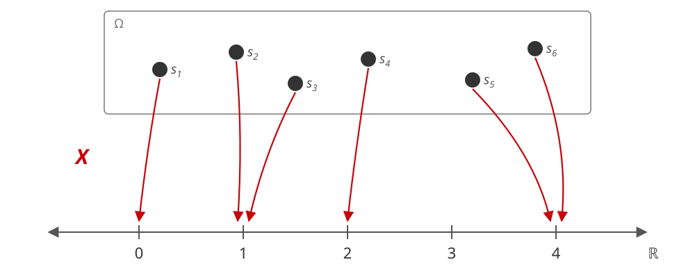

## Welcome back! {.title-slide}

<!-- MathJax macros for the whole deck. The reveal math plugin overwrites
     window.MathJax, so a header config would be clobbered; defining them in
     the first slide registers them before any later slide is typeset. The
     wrapper takes up no space and renders nothing. -->
::: {style="position:absolute;width:0;height:0;overflow:hidden;opacity:0"}
$$
\newcommand{\Var}{\text{Var}}
$$
:::

## Week overview

::: {.incremental}

- Last week
  - Conditional probability
  - Independence and conditional independence
  - Bayes' rule
- This week
  - **Random variables**
  - **Distributions**
  - **Expectations and variances**

:::

## Where we're going

::: {.incremental}

- This week, we'll go beyond **events** and illustrate a way of talking about random processes that map on to the **real numbers** $\mathbb{R}$
  - These are what we'll call **random variables**
- Random variables are defined by their **distributions**
  - We'll summarize features of these distributions with quantities like the **expectation** and the **variance**
- These will eventually be our empirical **estimands**
  - The share of residents of Wisconsin who turn out in the 2026 midterm election.
  - The share of residents of a given Wisconsin precinct who turn out in the 2026 midterm election **given** that precinct's 2024 Harris vote share.
- We will use our observed data to provide **estimates** of these quantities
  - Assume our observations came from the distribution of interest...how "close" is our estimate to the truth?
  - How can we talk about this when we **don't know** the truth!?

:::

## Random variables

::: {.incremental}

- There are clear limitations in using the language of **events** alone in talking about probabilities
- **Example:** Suppose we're trying to measure **income** using a random **survey**
  - Let $A_{ik}$ be the event that the respondent $i$ has an income of exactly $k$ dollars.
  - How would we represent the probability that a randomly selected respondent has an income between \$50,000 and \$100,000?

    $$
    \begin{aligned}
    P\left(\bigcup_{k = 50{,}000}^{100{,}000} A_{ik}\right) &= \sum_{k = 50{,}000}^{100{,}000} P(A_{ik}) \\
    &= P(A_{i,50000}) + P(A_{i,50001}) + \cdots + P(A_{i,99999}) + P(A_{i,100000})
    \end{aligned}
    $$

- Suppose we measure in **dollars** but want to calculate the probability that the respondent has an income between **£50,000 and £100,000**?
  - Suppose the exchange rate is itself **random**?

- There has to be a better way!

:::

## Random variables

- A **random variable** is a function that maps from the *sample space* $\Omega$ to the *real numbers* $\mathbb{R}$
  - Returning to our income example, we can now say that $X_i$ is a random variable denoting respondent $i$'s income in dollars
  - Now we can write the probability of our earlier event as $P(50{,}000 \le X_i \le 100{,}000)$

  {fig-align="center" width="85%"}


## Random variables

::: {.incremental}

-  We can construct random variables as functions of other random variables!
  - Let $R$ be a random variable denoting the USD-GBP (pounds per dollar) exchange rate on a given day.
  - Let $Y_i = R \times X_i$
  - The probability that the respondent has an income between **£50,000 and £100,000** is just 
    $$P (50{,}000 \le Y_i \le 100{,}000) $$

  - $Y_i$ is itself another random variable!

:::

## Random variables: Notation

::: {.incremental}

- We typically refer to **random variables** using capital roman letters
  - (e.g. $X$, $Y$, $D$)
  - Sometimes subscripted when we have repetitions across some margin ($i$ for units or $t$ for time)
- We'll refer to a **realization** of a random variable using lower-case roman letters
  - e.g. $P(X = x)$ refers to the probability that a random variable $X$ takes on a specific value $x$.
- We'll refer to the **support** of a random variable with a calligraphic capital letter $\mathcal{X}$
  - The **support** of a random variable $X$ is the **set** of all values where $X$ has non-zero probability (or density for continuous r.v.) 

:::

## Distribution functions

::: {.incremental}

- Random variables can be defined by their **distribution** function
  - Typically denoted with a capital $F(\cdot)$
  - Sometimes subscripted to specify the particular random variable: $F_X(\cdot)$
- The **cumulative distribution function** (CDF) gives the **probability** that a particular random variable $X$ takes on a value **less than or equal to** $x$

  $$ F_X(x) = P(X \le x) $$

::: {.fragment}

```{r}
#| echo: false
#| fig-width: 9
#| fig-height: 2.7
#| fig-align: center

library(ggplot2)
library(patchwork)

cdf_theme <- theme_minimal(base_size = 13) +
  theme(panel.grid.minor = element_blank(),
        plot.title = element_text(size = 13, face = "bold"),
        plot.background = element_rect(fill = "#F7F7F7", colour = NA),
        panel.background = element_rect(fill = "#F7F7F7", colour = NA))

# Poisson CDF is a step function: flat on [k, k + 1), closed at the left end
k <- 0:8
pois <- data.frame(k = k, F = ppois(k, lambda = 2))

p_pois <- ggplot(pois) +
  geom_segment(aes(x = k, xend = k + 1, y = F, yend = F),
               linewidth = 1.1, colour = "#c5050c") +
  annotate("segment", x = -1, xend = 0, y = 0, yend = 0,
           linewidth = 1.1, colour = "#c5050c") +
  geom_point(aes(k, F), size = 2.2, colour = "#c5050c") +
  scale_x_continuous(breaks = 0:8, limits = c(-1, 9), expand = c(0, 0)) +
  scale_y_continuous(limits = c(0, 1), expand = c(0.02, 0)) +
  labs(title = "Poisson(2)", x = "x", y = "F(x)") +
  cdf_theme

# Exponential with rate 2: the waiting time between events of a rate-2 Poisson process
x <- seq(-0.5, 3, length.out = 400)
p_exp <- ggplot(data.frame(x = x, F = pexp(x, rate = 2)), aes(x, F)) +
  geom_line(linewidth = 1.1, colour = "#c5050c") +
  scale_x_continuous(limits = c(-0.5, 3), expand = c(0, 0)) +
  scale_y_continuous(limits = c(0, 1), expand = c(0.02, 0)) +
  labs(title = "Exponential(2)", x = "x", y = "F(x)") +
  cdf_theme

# patchwork draws its own (white) background around the two panels
p_pois + p_exp +
  plot_annotation(theme = theme(plot.background = element_rect(fill = "#F7F7F7", colour = NA)))
```

:::

:::

## Distribution functions

::: {.incremental}

- The **range** of a CDF is between $0$ and $1$
  - Its output is a **probability** - probabilities can't be negative or greater than $1$
- The CDF is **non-decreasing**
  - Remember the conjunction fallacy!
  - Can't make a probability of an event **smaller** by having it encompass more outcomes!
- Limits
  - As $x \to \infty$, $F_X(x) \to 1$
  - As $x \to -\infty$, $F_X(x) \to 0$

:::

## Distribution functions

::: {.incremental}

- The probability that $X$ lies between two values is just the difference between two evaluations of the CDF.

  $$P(a < X \le b) = F_X(b) - F_X(a) $$

- Why? Consider that $X \le b$ is the union of two disjoint events: $X \le a$ and $a < X \le b$
- The probability of the union of two disjoint events is the sum of their probabilities.

  $$
  \begin{aligned}
  F_X(b) - F_X(a) &= P(X \le b) - P(X \le a) \\
  &= P([X \le a] \cup [a < X \le b]) - P(X \le a) \\
  &= P([X \le a]) + P([a < X \le b]) - P(X \le a) \\
  &= P(a < X \le b)
  \end{aligned}
  $$

  
:::

## Discrete random variables

::: {.incremental}

- We typically discuss two types of random variables: **discrete** and *continuous*
  - Discrete random variables take on a *finite* or *countably infinite* number of values.
  - As a result, we can talk about its **support** as the set where $P(X = x) > 0$
  - In fact, $P(X = x)$ is a coherent idea!
- In the social sciences, essentially everything is *discrete*
  - Our samples are from **large** but **finite** populations (e.g. $262{,}083{,}034$ voting age U.S. residents as of 2023).
  - Our outcomes are discretized (finite number of response options: support/oppose, 5-point Likert).
  - Even something like **income** is technically discrete
- Continuous random variables typically arise as **limits** and/or **approximations**

:::

## Probability mass functions (PMF)

::: {.incremental}

- A **discrete random variable** has a **probability mass function** (PMF)
  - Typically written as lower-case $p(\cdot)$

- The PMF gives the **probability** that a particular random variable $X$ takes on a value **equal to** $x$

  $$p_X(x) = P(X = x) $$

::: {.fragment}

```{r}
#| echo: false
#| fig-width: 9
#| fig-height: 2.7
#| fig-align: center

# Reuses p_pois and cdf_theme from the CDF slide
p_pmf <- ggplot(data.frame(k = k, p = dpois(k, lambda = 2)), aes(k, p)) +
  geom_segment(aes(xend = k, y = 0, yend = p), linewidth = 1.1, colour = "#c5050c") +
  geom_point(size = 2.2, colour = "#c5050c") +
  scale_x_continuous(breaks = 0:8, limits = c(-1, 9), expand = c(0, 0)) +
  scale_y_continuous(limits = c(0, 0.3), expand = c(0.02, 0)) +
  labs(title = "Poisson(2) PMF", x = "x", y = "p(x)") +
  cdf_theme

p_pmf + (p_pois + labs(title = "Poisson(2) CDF")) +
  plot_annotation(theme = theme(plot.background = element_rect(fill = "#F7F7F7", colour = NA)))
```

:::

:::

## Probability mass functions (PMF)

::: {.incremental}

- PMFs are **non-negative**: $p_X(x) > 0$ for $x$ in the support and $0$ otherwise
  - Again, PMFs return **probabilities**
- PMFs sum to $1$ over the support of $X$

  $$ \sum_{x \in \mathcal{X}} p_X(x) = 1 $$

- One can get the **CDF** by summing the PMF over all values *less than or equal to* $x$.

  $$ F_X(x) = \sum_{t \in \mathcal{X} : t \le x} p_X(t) $$

:::

## Bernoulli distribution

::: {.incremental}

- The simplest discrete probability distribution is the **Bernoulli** distribution
  - This is the distribution of a **weighted coin flip** with "success" probability $p$

$$
P(X = x) = \begin{cases}
p & \text{if } x = 1 \\
1 - p & \text{if } x = 0 \\
0 & \text{otherwise}
\end{cases}
$$

- We'll use the $\sim$ syntax to denote that a variable has a particular distribution with particular parameters

$$ X \sim \text{Bernoulli}(p) $$

- Bernoulli random variables often arise from **indicator** functions $\mathbf{1}(\cdot)$ applied to events $A$

$$ \mathbf{1}(A) \sim \text{Bernoulli}(p) \quad p = P(A) $$

:::

## Example: List experiments

::: {.incremental}

- Getting people to be honest on surveys can be difficult for some types of questions.
  - **Social desirability bias** may make some respondents reticent to give truthful answers
- The **2012 Mexico Panel Study** [@greene2016mexico] wanted to study the prevalence of **vote buying** in the 2012 Mexican presidential election
  - Exchanging a vote for a gift is illegal - survey respondents may not want to admit to a crime!
- **Solution**: A **list experiment** - Respondents are randomly assigned to a "treated" or a "control" group
- Respondents see a list of items and are asked **how many** items on that list they did in recent weeks (not **which ones**)
  1. See a television newscast that mentions a candidate
  2. Attend a campaign event
  3. Talk about politics with other people
  4. **Treated group only:** Exchange your vote for a gift, favor, or access to a service

- Respondents who admit to vote buying are not identifiable (except in one edge case!)
  - But with some assumptions, we can learn the **share** of respondents who experienced vote buying.

:::

## Example: List experiments

::: {.incremental}

- Let $C_i$ be the **number** of items that respondent $i$ would say they did if **assigned to control**
  - $C_i$ is a **random variable** (randomness from both sampling and treatment assignment)
  - It is a discrete random variable that takes on *integers* from $0$ to $3$
- Let $T_i$ be the **number** of items that respondent $i$ would say they did if **assigned to treatment**
  - Here the random variable ranges from integers $0$ to $4$.

- The simplest way to define these distributions is to assign a unique parameter to each possible value

  $$
  P(C_i = c) = \begin{cases}
  p_0 & \text{if } c = 0 \\
  p_1 & \text{if } c = 1 \\
  p_2 & \text{if } c = 2 \\
  p_3 & \text{if } c = 3 \\
  0 & \text{otherwise}
  \end{cases}
  \qquad p_c \ge 0, \quad \sum_{c=0}^{3} p_c = 1
  $$

:::

## Example: List experiments

```{r}
#| echo: false
#| message: false
#| fig-width: 9
#| fig-height: 3.2
#| fig-align: center

# Empirical PMFs of the item counts, one panel per list
mexico <- read.csv("data/mexico_list.csv")

list_hist <- function(d, J, colour, title) {
  props <- data.frame(y = 0:J, p = as.numeric(table(factor(d$y, levels = 0:J))) / nrow(d))
  ggplot(props, aes(y, p)) +
    geom_col(width = 0.65, fill = colour) +
    scale_x_continuous(breaks = 0:J) +
    scale_y_continuous(limits = c(0, 0.5), expand = c(0, 0)) +
    labs(title = title, x = "Number of items", y = "Proportion") +
    cdf_theme
}

list_hist(subset(mexico, treat == 0), 3, "#0479A8", "Control list") +
  list_hist(subset(mexico, treat == 1), 4, "#c5050c", "Treated list") +
  plot_annotation(theme = theme(plot.background = element_rect(fill = "#F7F7F7", colour = NA)))
```

## Example: List experiments

::: {.incremental}

- We want to try to learn about the probability of responding to the sensitive item.
  - Let $Z_i \sim \text{Bernoulli}(\theta)$ be the random variable denoting whether respondent $i$ engaged in **vote buying**

- Now we'll make some assumptions about how $Z_i$ relates to the other two variables

  $$ \underbrace{T_i}_{\text{treated count}} = \underbrace{C_i}_{\text{control count}} + \underbrace{Z_i}_{\text{sensitive item}} $$

- We've defined the **data generating process** for the list experiment!
  - What's the key behavioral assumption hidden here?
  - Respondents' reaction to the baseline items **doesn't change** if they're exposed to the sensitive item.

:::

## Binomial distribution

::: {.incremental}

- We saw how the most flexible way to represent any discrete random variable defined on a **finite** support is to just assign a unique parameter to each unique value.
  - But this can get unwieldy for a lot of statistical tasks - can we be more **parsimonious**?
  - What if we assumed that respondents had a **common** probability $p$ of responding yes to each component of the list and that items were **independent**
- Then we would get the **Binomial** distribution: the distribution of the **sum** of *independent* and *identical* *weighted* coin flips
  - Two parameters: $N$: Number of trials, $p$: Success probability

  $$
  P(X = x) = \begin{cases}
  \binom{N}{x} p^x (1 - p)^{N - x} & \text{if } x \in \{0, 1, \dots, N\} \\
  0 & \text{otherwise}
  \end{cases}
  $$

:::

## Fitting a Binomial {.app-slide}

::: {.app-frame data-app="binomial_app.html" data-title="Fitting a Binomial to the list experiment"}
:::

::: {.attribution}
2012 Mexico Panel Study, Wave 2 [@greene2016mexico]
:::

```{=html}
<script>
// The widget is a separate page framed here. The <iframe> is built at runtime
// because `embed-resources: true` would otherwise inline the target into a
// data: URI, breaking the app's relative asset paths and its service worker.
// Mounting only once the slide is reached also delays the webR download.
(function () {
  function mount() {
    document.querySelectorAll("section.present .app-frame[data-app]").forEach(function (el) {
      if (el.dataset.mounted) return;
      el.dataset.mounted = "1";
      var f = document.createElement("iframe");
      f.src = el.dataset.app;
      f.title = el.dataset.title || "Interactive widget";
      f.setAttribute("allow", "clipboard-write");
      el.appendChild(f);
    });
  }
  // Reveal is not defined while this script is parsed, so wire up after load.
  window.addEventListener("load", function () {
    if (window.Reveal && typeof Reveal.on === "function") Reveal.on("slidechanged", mount);
    mount();
  });
})();
</script>
```

## Expected value

::: {.incremental}

- One very important property of a random variable is its **expectation** $\mathbb{E}[X]$
  - Can think of this as a **summary** of that random variable's "long-run" behavior.

- For a **discrete** random variable, the expectation is a **weighted average** of that variable's possible outcomes with the weights given by the **probability** of each outcome

  $$ \mathbb{E}[X] =  \sum_{x \in \mathcal{X}} x \cdot P(X = x) $$

```{r}
#| echo: false
#| fig-width: 10
#| fig-height: 2.4
#| fig-align: center

# Expectation as the balancing point: the PMF's bars sit on a beam (the x-axis)
# and the triangle is the fulcrum at E[X]. Weights are chosen so every E[X] is a
# half: the fair die balances at 7/2, the symmetric (3:2:1:1:2:3)/12 die also
# at 7/2 despite its different shape, the loaded die (1:2:3:4:6:8)/24 at 9/2.
die_pmf <- function(w, colour) {
  d <- data.frame(x = 1:6, p = w / sum(w))
  ev <- sum(d$x * d$p)
  ggplot(d, aes(x, p)) +
    geom_col(width = 0.6, fill = colour) +
    annotate("segment", x = 0.5, xend = 6.5, y = 0, yend = 0,
             linewidth = 1.6, colour = "#333333") +
    annotate("polygon", x = ev + c(-0.26, 0.26, 0), y = c(-0.075, -0.075, -0.004),
             fill = "#333333") +
    # Outcomes sit just under the beam; E[X] is a half, so the fulcrum falls
    # between two of them rather than on top of one
    annotate("text", x = 1:6, y = -0.035, label = 1:6, size = 3.8, colour = "#555555") +
    annotate("text", x = ev, y = -0.115, size = 3.8, colour = "#333333",
             label = paste0("E[X] = ", ev * 2, "/2")) +
    scale_x_continuous(breaks = NULL) +
    scale_y_continuous(breaks = NULL, limits = c(-0.14, 0.38), expand = c(0, 0)) +
    labs(x = NULL, y = NULL) +
    cdf_theme +
    theme(panel.grid = element_blank())
}

die_pmf(rep(1, 6), "#0479A8") +
  die_pmf(c(3, 2, 1, 1, 2, 3), "#C77400") +
  die_pmf(c(1, 2, 3, 4, 6, 8), "#c5050c") +
  plot_annotation(theme = theme(plot.background = element_rect(fill = "#F7F7F7", colour = NA)))
```

:::

## Expectations of functions

::: {.incremental}

- An interesting property of the expected value is what is sometimes called the **Law of the Unconscious Statistician** (LOTUS)
- Suppose I want to calculate the expectation of some **function** of $X$, denoted $g(X)$.

- If I just looked at the definition of expectation, I'd think:
  - "What if I just plugged in $g(x)$ instead of $x$ and took the average over the same weights?"

- It turns out that works!

  $$\mathbb{E}[g(X)] = \sum_{x \in \mathcal{X}} g(x) \cdot P(X = x) $$

:::

## Linearity of expectations

::: {.incremental}

- Another essential property of expectations is **linearity**
  - The **expectation of the sum** is the **sum of the expectations**

- Let $X$ and $Y$ be two random variables

  $$\mathbb{E}[X + Y] =  \mathbb{E}[X] + \mathbb{E}[Y] $$

- Let $a$ and $b$ be constants: we can pull the constants out of the expectation

  $$\mathbb{E}[aX + bY] =  a\mathbb{E}[X] + b\mathbb{E}[Y] $$

- You'll see this most often with sums over random variables indexed along some dimension

  $$\mathbb{E}\bigg[\sum_{i=1}^n a X_i\bigg] = \sum_{i=1}^n\mathbb{E}[a X_i] = \sum_{i=1}^n a\mathbb{E}[X_i] = a\sum_{i=1}^n \mathbb{E}[X_i]$$

:::

## Expectation of the Bernoulli

::: {.incremental}

- Let $X \sim \text{Bernoulli}(p)$
- There are two possible values, let's calculate the expectation!

  $$
  \begin{aligned}
  \mathbb{E}[X] &= \sum_{x \in \{0, 1\}} x \cdot P(X = x) \\
  &= 0 \cdot P(X = 0) + 1 \cdot P(X = 1) \\
  &= 0 \cdot (1 - p) + 1 \cdot p \\
  &= p
  \end{aligned}
  $$

- The **expected value** of a Bernoulli/indicator random variable is just the **probability** that it takes on a value of $1$
  - This is the **fundamental bridge** between expectations and probability [@blitzstein2019introduction]

:::

## Expectation of the Binomial

::: {.incremental}

- Now let $X \sim \text{Binomial}(N, p)$
- We could write this out and use properties of sums of factorials

  $$ \mathbb{E}[X] = \sum_{x=0}^{N} x \cdot \binom{N}{x} p^x (1 - p)^{N - x} $$

- Or we could use **linearity** of expectations - much easier!

:::

## Expectation of the Binomial

::: {.incremental}

- Recall that the **Binomial** is the sum of $N$ independent and identically distributed **Bernoulli** random variables with success probability $p$

  $$X = \sum_{i=1}^N X_i \quad\quad\quad X_i \sim \text{Bernoulli}(p) $$

- Applying linearity of expectations

  $$\mathbb{E}[X] = \mathbb{E}\bigg[\sum_{i=1}^N X_i\bigg] = \sum_{i=1}^N \mathbb{E}[X_i]$$

- Plugging in our expectation of the Bernoulli and summing

  $$ \mathbb{E}[X] = Np $$

:::

## Example: List experiment

::: {.incremental}

- Let's return to our list experiment example. Remember, we have 

  $$ \underbrace{T_i}_{\text{treated count}} = \underbrace{C_i}_{\text{control count}} + \underbrace{Z_i}_{\text{sensitive item}} $$

- We want to know $P(Z_i = 1) = \theta$ - the share of respondents who participated in **vote buying**
- Taking expectations of both sides and using linearity

  $$ \mathbb{E}[T_i] = \mathbb{E}[C_i] + \theta $$

- Solving for $\theta$

  $$\theta  = \mathbb{E}[T_i] - \mathbb{E}[C_i] $$

:::

## Preview: Estimation

::: {.incremental}

- In our **sample**, we assume that we observe realizations of these two random variables
  - In the treated group we have $N_{T}$ draws of $T_i$
  - In the control group we have $N_{C}$ draws of $C_i$

- We'll plug-in an **estimate** of each expectation using its sample analogue: the average

  $$
  \begin{aligned}
  \hat{\theta} &= \widehat{\mathbb{E}}[T_i] - \widehat{\mathbb{E}}[C_i] \\
  &= \frac{1}{N_T} \sum_{i=1}^{N_T} T_i - \frac{1}{N_C} \sum_{i=1}^{N_C} C_i
  \end{aligned}
  $$

- Later, we'll show that under assumptions about **how** we got our sample (i.i.d. random smapling)...
  - ...these **sample** averages converge to the population **expected values** 
  - "law of large numbers"

- Note that we don't actually need the assumption that $C_i \sim \text{Binomial}(3, p)$ to estimate $\theta$
  - Just that exposure to the sensitive item doesn't alter responses to the baseline list

:::

## Preview: Estimation

```{r}
#| echo: true
#| message: false

library(tidyverse)
library(knitr)

# Sample means of the item count in each group
mexico |>
  group_by(Group = if_else(treat == 1, "Treated", "Control")) |>
  summarize(`Mean count` = mean(y), N = n()) |>
  kable(digits = 3)

# List experiment estimate of theta vs. share admitting vote buying when asked directly
mexico |>
  summarize(`List experiment` = mean(y[treat == 1]) - mean(y[treat == 0]),
            `Direct question` = mean(direct)) |>
  kable(digits = 3)
```

## Variance

::: {.incremental}

- Beyond the expectation, there are other summaries that capture other relevant features.
  - We may want to know how **spread out** realizations of the random variable are.
- The **variance** of a random variable $\Var(X)$ is the expected **squared** deviation from $\mathbb{E}[X]$

  $$\Var(X) = \mathbb{E}\bigg[(X - \mathbb{E}[X])^2\bigg] $$
- Expanding the square and applying linearity of expectation

  $$\Var(X) = \mathbb{E}[X^2] - \mathbb{E}[2X\mathbb{E}[X]] + \mathbb{E}[\mathbb{E}[X]^2]$$
- Pulling out the constant $2\mathbb{E}[X]$ and $\mathbb{E}[X]^2$

  $$
  \begin{aligned}
  \Var(X) &= \mathbb{E}[X^2] - 2\mathbb{E}[X]\mathbb{E}[X] + \mathbb{E}[X]^2 \\
  &= \mathbb{E}[X^2] - \mathbb{E}[X]^2
  \end{aligned}
  $$

:::

## Properties of variance

::: {.incremental}

- The variance is **non-negative**
  - By **Jensen's inequality** for a convex function: $\mathbb{E}[X^2] \ge \mathbb{E}[X]^2$

- For a random variable $X$ and a constant $a$

  $$ \Var(aX) = a^2\Var(X) $$

- But be careful, the variance of the sum of two random variables $X$ and $Y$ is **not** the sum of the variances except in a special case we'll talk about next week (independence)

  $$ \Var(X + Y) \neq \Var(X) + \Var(Y) $$

- Also, the variance of the **difference** is not the difference in the variances...even for independent random variables, it's still the sum of the variances ($-1$ gets squared!)
  - We'll talk about this more next week when we define **covariance**

:::

## Variance of a Bernoulli

::: {.incremental}

- Let's derive the variance of the Bernoulli. Let $X \sim \text{Bernoulli}(p)$

  $$
  \begin{aligned}
  \Var(X) &= \mathbb{E}[X^2] - \mathbb{E}[X]^2 \\
  &= \mathbb{E}[X] - \mathbb{E}[X]^2 \\
  &= p - p^2 \\
  &= p(1 - p)
  \end{aligned}
  $$

- The second line uses the fact that $X$ only takes on the values $0$ and $1$. $0^2 = 0$ and $1^2 = 1$.

- **Intuition**: The uncertainty around a coin-flip is **maximized** when it's fair!

:::

## Continuous random variables

- Recall the difference between the CDF of a **discrete** versus a **continuous** random variable.

```{r}
#| echo: false
#| fig-width: 9
#| fig-height: 2.7
#| fig-align: center

# Same figure as the CDF slide: reuses p_pois and p_exp from that chunk
p_pois + p_exp +
  plot_annotation(theme = theme(plot.background = element_rect(fill = "#F7F7F7", colour = NA)))
```


- The **discrete** variable's CDF has **discontinuities**, the **continuous** variable's CDF is **continuous** (and **differentiable** almost everywhere)

## Probability density functions (PDFs)

::: {.incremental}

- A **continuous** random variable is a random variable whose CDF is **continuous everywhere** and **differentiable** everywhere except possibly at a finite number of points [@blitzstein2019introduction]
  - The support of a continuous random variable is typically the set of real numbers $\mathbb{R}$ or an interval (or union of intervals) of the reals.

- The challenge with talking about a distribution defined on the **uncountably infinite** reals is that the probability of realizing any particular value $x$ is always **zero**

- Instead of a PMF, continuous random variables have a **probability density function** (PDF) - defined as the **derivative** of the CDF
  - Typical notation is a lowercase $f(\cdot)$

  $$ f_X(x) = \frac{d}{dx} F_X(x) $$

:::

## Probability density functions (PDFs)

::: {.incremental}

- It's not a probability, but it **integrates** to a probability.
  - From the **fundamental theorem of calculus**

  $$ F_X(x) = \int_{-\infty}^{x} f_X(t) dt $$

- This is similar to how we **summed** the PMF to get the CDF
- PDFs **integrate** to $1$ (just like how PMFs sum to $1$)

  $$ \int_{-\infty}^{\infty} f_X(x)dx = 1 $$ 

:::

## Probability density functions (PDFs)

::: {.incremental}

- And we can integrate the PDF over any *interval* to get the probability of $X$ falling in that interval.

  $$P(a < X \le b) =  \int_{a}^{b} f_X(x)dx $$

- Intuitively, this follows from our earlier definition using CDFs

  $$
  \begin{aligned}
  P(a < X \le b) &= F_X(b) - F_X(a) \\
  &= \int_{-\infty}^{b} f_X(x)dx - \int_{-\infty}^{a} f_X(x)dx \\
  &= \int_{a}^{b} f_X(x)dx
  \end{aligned}
  $$

:::

## Expectations of continuous random variables

::: {.incremental}

- We defined the expected value for a discrete random variable as a **sum**
  - We'll do the same for a continuous random variable using an **integral**

- For continuous $X$

  $$\mathbb{E}[X] = \int_{\mathcal{X}} x f(x) dx $$

- More generally, the distinction between discrete and continuous vanishes when we define integrals with respect to the distribution (Lebesgue integration)

  $$\mathbb{E}[X] = \int_{\mathcal{X}} x \, dF_X(x) $$

  - Rather than slicing up the **$x$-axis** into small intervals, we slice up the **probability** and ask how much of it sits at each value of $X$

- But we won't spend time on that in this class...your Riemann integral intuition (sum of the areas of tinier and tinier rectangles) is enough!

:::

## Normal distribution

::: {.incremental}

- The **normal** (or **Gaussian**) distribution is the most common continuous distribution you'll encounter
  - It's the **approximate** distribution of sums and means of independent random variables.
  - $X \sim \mathcal{N}(\mu, \sigma^2)$. Support over all of $\mathbb{R}$.

- The PDF is

  $$ f_X(x) = \frac{1}{\sqrt{2\pi\sigma^2}} \exp\left\{-\frac{(x - \mu)^2}{2\sigma^2}\right\} $$

- Two parameters, $\mu$ and $\sigma^2$
  - These parameters happen to be the expectation and variance!
  - $\mu = \mathbb{E}[X]$, $\sigma^2 = \Var(X)$

:::

## Normal distribution

```{r}
#| echo: false
#| fig-width: 9
#| fig-height: 4.7
#| fig-align: center

# Reuses cdf_theme from the CDF slide
zz <- seq(-4, 4, length.out = 600)

p_norm_pdf <- ggplot(data.frame(x = zz, f = dnorm(zz)), aes(x, f)) +
  geom_area(fill = "#c5050c", alpha = 0.15) +
  geom_line(linewidth = 1.1, colour = "#c5050c") +
  scale_x_continuous(breaks = -4:4, limits = c(-4, 4), expand = c(0, 0)) +
  scale_y_continuous(limits = c(0, 0.45), expand = c(0.02, 0)) +
  labs(title = "Normal(0, 1) PDF", x = "x", y = "f(x)") +
  cdf_theme

p_norm_cdf <- ggplot(data.frame(x = zz, F = pnorm(zz)), aes(x, F)) +
  geom_line(linewidth = 1.1, colour = "#c5050c") +
  scale_x_continuous(breaks = -4:4, limits = c(-4, 4), expand = c(0, 0)) +
  scale_y_continuous(limits = c(0, 1), expand = c(0.02, 0)) +
  labs(title = "Normal(0, 1) CDF", x = "x", y = "F(x)") +
  cdf_theme

p_norm_pdf + p_norm_cdf +
  plot_annotation(theme = theme(plot.background = element_rect(fill = "#F7F7F7", colour = NA)))
```


## Normal distribution

```{r}
#| echo: false
#| fig-width: 9
#| fig-height: 4.5
#| fig-align: center

norm_pars <- expand.grid(x = seq(-6, 6, length.out = 600),
                         par = c("N(0, 1)", "N(2, 1)", "N(0, 4)"))
norm_pars$mu <- c(0, 2, 0)[as.integer(norm_pars$par)]
norm_pars$sd <- c(1, 1, 2)[as.integer(norm_pars$par)]
norm_pars$f <- dnorm(norm_pars$x, norm_pars$mu, norm_pars$sd)
norm_pars$F <- pnorm(norm_pars$x, norm_pars$mu, norm_pars$sd)

norm_cols <- c("N(0, 1)" = "#c5050c", "N(2, 1)" = "#0479a8", "N(0, 4)" = "#646569")

p_par_pdf <- ggplot(norm_pars, aes(x, f, colour = par)) +
  geom_line(linewidth = 1.1) +
  scale_colour_manual(values = norm_cols, name = NULL) +
  scale_x_continuous(limits = c(-6, 6), expand = c(0, 0)) +
  scale_y_continuous(limits = c(0, 0.45), expand = c(0.02, 0)) +
  labs(title = "PDF", x = "x", y = "f(x)") +
  cdf_theme + theme(legend.position = "bottom")

p_par_cdf <- ggplot(norm_pars, aes(x, F, colour = par)) +
  geom_line(linewidth = 1.1) +
  scale_colour_manual(values = norm_cols, name = NULL) +
  scale_x_continuous(limits = c(-6, 6), expand = c(0, 0)) +
  scale_y_continuous(limits = c(0, 1), expand = c(0.02, 0)) +
  labs(title = "CDF", x = "x", y = "F(x)") +
  cdf_theme + theme(legend.position = "bottom")

p_par_pdf + p_par_cdf + plot_layout(guides = "collect") +
  plot_annotation(theme = theme(plot.background = element_rect(fill = "#F7F7F7", colour = NA),
                                legend.position = "bottom"))
```

## The standard normal

::: {.incremental}

- $\mathcal{N}(0, 1)$ is referred to as the **standard normal**
  - PDF and CDF typically written as: $\phi(z)$ and $\Phi(z)$

    $$ \phi(z) = \frac{1}{\sqrt{2\pi}} e^{-z^2/2} $$

- Any normal can be **standardized**. If $X \sim \mathcal{N}(\mu, \sigma^2)$, then

  $$ Z = \frac{X - \mu}{\sigma} \sim \mathcal{N}(0, 1) $$

- $\Phi$ has **no closed form**
  - This is why old stats books had tables of pre-computed quantiles of the normal distribution!
  - And why we'll rely on our computer + various approximations to evaluate the CDF (`pnorm()`)

:::

## Areas under the normal curve

```{r}
#| echo: false
#| fig-width: 10
#| fig-height: 4.3
#| fig-align: center

# `rule` is the rounded number students should memorize; the exact integral sits below it
sd_panel <- function(k, rule) {
  d <- data.frame(x = seq(-4, 4, length.out = 800))
  d$f <- dnorm(d$x)
  prob <- pnorm(k) - pnorm(-k)
  ggplot(d, aes(x, f)) +
    geom_area(data = subset(d, x >= -k & x <= k), fill = "#c5050c", alpha = 0.25) +
    geom_line(linewidth = 1.1, colour = "#c5050c") +
    geom_segment(x = -k, xend = -k, y = 0, yend = dnorm(k),
                 linetype = "dashed", colour = "#646569") +
    geom_segment(x = k, xend = k, y = 0, yend = dnorm(k),
                 linetype = "dashed", colour = "#646569") +
    # double-headed arrow marking the width of the interval
    annotate("segment", x = -k, xend = k, y = 0.055, yend = 0.055,
             colour = "#282728", linewidth = 0.5,
             arrow = arrow(ends = "both", length = unit(0.045, "npc"), type = "closed")) +
    # sit the labels in headroom above the peak so they never cross the density
    annotate("text", x = 0, y = 0.51, label = rule,
             size = 5.6, fontface = "bold", colour = "#282728") +
    annotate("text", x = 0, y = 0.44, label = sprintf("(%.2f%%)", 100 * prob),
             size = 3.6, colour = "#646569") +
    scale_x_continuous(breaks = -3:3, limits = c(-4, 4), expand = c(0, 0)) +
    scale_y_continuous(breaks = seq(0, 0.4, 0.1), limits = c(0, 0.56),
                       expand = c(0.02, 0)) +
    labs(title = bquote(mu %+-% .(k) * sigma), x = "z", y = expression(phi(z))) +
    cdf_theme
}

sd_panel(1, "\u2248 68%") + sd_panel(2, "\u2248 95%") + sd_panel(3, "\u2248 99.7%") +
  plot_annotation(theme = theme(plot.background = element_rect(fill = "#F7F7F7", colour = NA)))
```


## Next week

::: {.incremental}

- Joint distributions
  - Defining the distribution of $X$ and $Y$ (and $Z$, and...) together!
- Conditional distributions
  - **Slicing** the joint distribution at a particular point
- Conditional expectations and the best linear predictor
  - Law of total expectation
- Covariances and correlations

:::

## References {.refs-slide}

::: {#refs}
:::
