## Welcome back! {.title-slide}

<!-- MathJax macros for the whole deck. The reveal math plugin overwrites
     window.MathJax, so a header config would be clobbered; defining them in
     the first slide registers them before any later slide is typeset. The
     wrapper takes up no space and renders nothing. -->
::: {style="position:absolute;width:0;height:0;overflow:hidden;opacity:0"}
$$
\newcommand{\Var}{\text{Var}}
\newcommand{\Cov}{\text{Cov}}
\newcommand{\Corr}{\text{Corr}}
\newcommand{\indep}{\mathrel{\perp\mkern-10mu\perp}}
$$
:::

## Week overview

::: {.incremental}

- Last week
  - Joint and conditional distributions
  - Covariance and correlation
  - Conditional expectations and the best linear predictor
- This week
  - **What is a scientific theory for?**
  - **Asking a research question**: What is your estimand?
  - **Descriptive** versus **causal** questions
  - Connecting the theoretical estimand to an **empirical** estimand
- **Midterm** on Wednesday!

:::

## Why theory?

::: {.incremental}

- What makes science distinct from pseudoscience?

:::

## What is a scientific theory for?

::: {.incremental}

- A theory consists of a set of **assumptions**...
- ...from which we deductively derive **propositions**...
- ...which have **implications** for what we observe in the world.

:::

## The stylized scientific method

::: {.incremental}

1. Formulate a theory
2. Derive empirical implications
3. Test those implications 
4. If the implications hold, keep the theory. If they don't, change the theory.

:::

## The principle of "falsification"

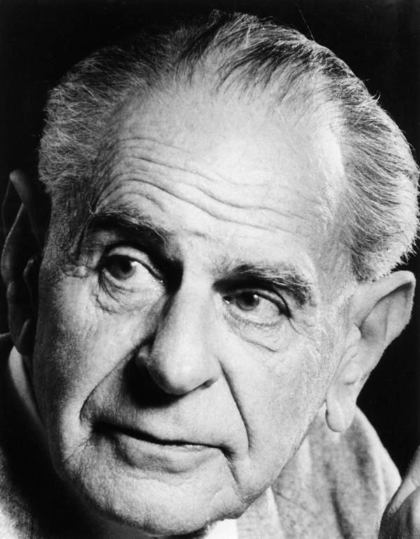{fig-align="center" width=500px}

## The principle of "falsification"

::: {.incremental}

- **Popper (1935)** Theories cannot be proven **true** but they can be demonstrated to be **false**

  > "In so far as a scientific statement speaks about reality, it must be falsifiable; and in so far as it is not falsifiable, it does not speak about reality." (Popper, 1935)

- A scientific statement **sets the conditions** under which it could be demonstrated wrong
  - Is there an experimental finding that would **contradict** a theory's predictions?
  
:::
  
## The problems with falsification alone

::: {.incremental}

- Let's consider a classic **political science** theory: **Duverger's Law**
  - This is a theory about how an **electoral system** affects the **number of parties** in that system.

- With **plurality rule** in **single member district** elections, it predicts **two parties**
- **Proportional** systems lead to **many parties**

- What's the logic?
  - Voters don't want to waste their vote on a third party that has no chance of winning.

:::

## The problems with falsification

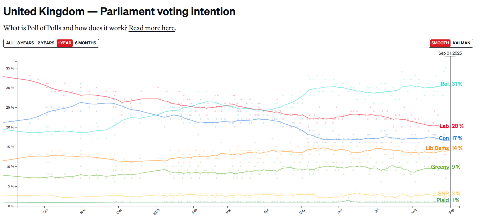{fig-align="center" width=800}

## Scientific "revolutions"

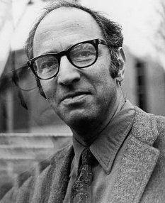{fig-align="center" width=500}

## Scientific "revolutions"

::: {.incremental}

- **Kuhn (1962)**: Scientists work in **paradigms**
  - A set of theories, research tools, and values describing a particular scientific field.
- **Normal science**
  - Scientists accumulate empirical findings that fit the paradigm
  - Anomalies are discarded until...
- **Scientific revolutions**
  - The anomalies are too many!
  - The community develops a new paradigm to explain the anomalies.
  - How?  `¯\_(ツ)_/¯`
- Many unanswered questions!
  - Can we say that any theory is meaningfully "more true" compared to another?
  - Is there progress in science?

:::

## Research programmes

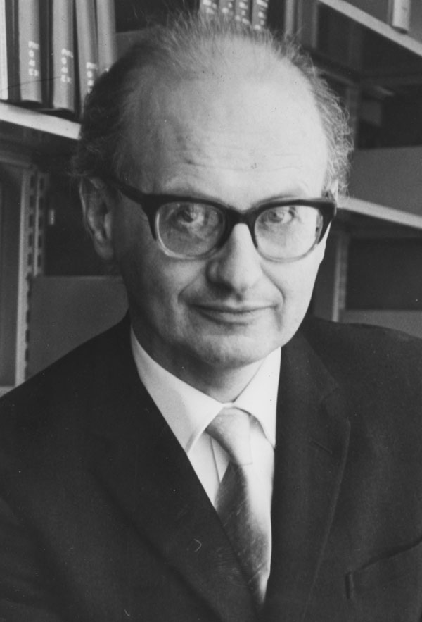{fig-align="center" width=500}

## Research programmes

::: {.incremental}

- **Lakatos (1970)**: A **middle ground** between falsificationism and methodological anarchy
- Science is not interested in just a single **theory** - science is built around research **programmes**
  - Democracy and autocracy
  - Voters and elections
  - Political economy
- Theories are built around a **core** of assumptions that are hard to challenge
  - (e.g. rational actor model)
- The core is surrounded by "auxiliary" hypotheses - more open to revision
  - (e.g. voters punish incumbents for bad economic outcomes)
- Findings that go against the theory lead to revisions of **auxiliary** hypotheses
  - (e.g. maybe different economic outcomes matter more - inflation vs. unemployment?)

:::

## Research programmes

::: {.incremental}

- **Productive** research programmes 
  - Revisions in the auxiliary hypotheses lead to changes in theories **that generate new, useful predictions**
- **Unproductive** research programmes keep having to add modifications just to stay afloat!

:::

## Science is social

::: {.incremental}

- **Scientists** are human beings
  - They interact with one another - a community of **peers**
  - They are motivated by **incentives**
- Ideally, these incentives are aligned with the goal of a productive research programme!
  - Finding evidence that discredits old ways of thinking.
  - Inventing new ways of thinking that explain both new and old evidence
  - But the process isn't perfect...
- **Science is what scientists do.**

:::

## Back to Duverger's Law

::: {.incremental}

- Single-member systems don't consistently get two major parties - **Canada (the BQ), UK (Greens, Lib-Dems, Reform)**
  - Is Duverger's Law a **bad theory?** 
  - Or just in need of **refinement?** 
- Do we revise the auxiliary hypotheses
  - (e.g. Can strategic voters create systems with more than two parties under plurality/single member districts?)
- Or do we need to revise the core?
  - (e.g. Voters aren't strategic!)

:::

## Explaining the UK

{fig-align="center" width=800}

## What's the point of theory

::: {.incremental}

- "All models are wrong, but some are useful"
- Scientific theory is a **guide** to generating new questions to ask about the world
- A way of **structuring** our thinking and simplifying complex phenomena
- Theory **synthesizes** lots of disparate studies - a tool for building **knowledge**

:::

## Using theory

::: {.incremental}

- **Theories** generate **implications** - predictions that we can connect to empirical tests
  - Duverger's Law is an **observable implication** of a model of voter behavior
  - What are some observable implications of "modernization theory" and democratization?
- **Theories** have **scope conditions**
  - What are the settings where a particular model "works" and when does it not?
- **Theories** usually provide **mechanisms**
  - Connected to **scope conditions** - if the mechanism is absent, the theory may not be useful.
  
:::

## Some general principles of theory-building

::: {.incremental}

- **Falsifiability** - With all of the caveats from before, it is still valuable for theories to generate predictions that can be evaluated with empirical evidence.
- **Parsimony** - Theories with lots and lots of moving parts and factors are less compelling than those that are simpler **as long as they explain the same phenomena**.
- **Novelty** - Good theories try to explain what has been previously unexplained.  Complexity is valuable **when it explains some new empirical phenomena**

:::

## Inference to the Best Explanation

::: {.incremental}

- **Brainstorm** a *lot* of potential explanations for the world
  - (e.g. what factors explain why voters vote the way they do?)
- **Derive** the observable implications of those explanations
- **Get the facts**
  - This is the main point of this class
- **Pick** the explanation consistent with most of the facts

:::

## Asking a research question

## What's your estimand?

>  Every quantitative study must be able to answer the question: **what is your estimand?** The estimand is the target quantity—the purpose of the statistical analysis. Much attention is already placed on how to do estimation; a similar degree of care should be given to defining the thing we are estimating. We advocate that authors **state the central quantity of each analysis**—the theoretical estimand—in precise terms that exist outside of any statistical model. In our framework, researchers do three things: (1) set a theoretical estimand, clearly connecting this quantity to theory; (2) **link to an empirical estimand**, which is informative about the theoretical estimand under some identification assumptions; and (3) **learn from data**. 

Lundberg, Ian, Rebecca Johnson, and Brandon M. Stewart. "What is your estimand? Defining the target quantity connects statistical evidence to theory." American Sociological Review 86.3 (2021): 532-565.

## Types of research questions

::: {.incremental}

- **Descriptive** - **"What?"**
  - What is the share of U.S. Hispanic voters who voted for Donald Trump in 2024?
  - How many political posts on Facebook are false information?
  - What is the structure of the co-sponsorship network in the U.S. Congress?
  
- **Causal** - **What if?** ("Effects of Causes")
  - Does weakening central bank independence increase inflation?
  - Does changing an individual's news diet change their attitudes?
  - Does giving someone a guaranteed income affect their willingness to search for employment?
  
- **Explanatory** - **Why?** ("Causes of Effects")
  - Why do states go to war?
  - Why do political parties dissolve?
  - Why do recessions occur?

- **Descriptive** and **Causal** questions are tied to **empirical** analyses
- **Explanatory** questions are typically about **theory**

:::

## Questions lead to more questions!

::: {.incremental}

- **What?** questions lead to **What if?**
  - How common is false information on Facebook? $\leadsto$ Does **banning** "disinfo" accounts reduce its spread?
  - What share of voters think immigration is an important national issue? $\leadsto$ Does making people more **anxious** increase the perceived importance of immigration?
  
- **Why?** questions lead to **What if?**
  - Why do states go to war? $\leadsto$ If the U.S. withdraws as global hegemon, will that increase the risk of conflict?
  - Why does poverty exist? $\leadsto$ Can expanding early childhood education increase children's future incomes?
  
:::

## Turning "What?" into "What if?"

::: {.incremental}

- "Would you have a friendship with someone who disagrees with you politically?"
  
:::

## "Why" questions are often not empirical!

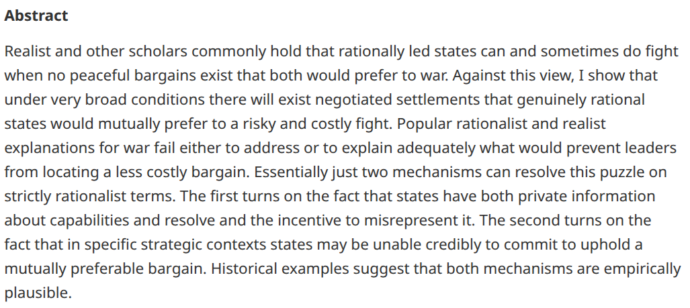{fig-align='center' width=800}

## Asking is one thing, answering is another

::: {.incremental}

- You don't just want to ask **a** question. You want to ask an **answerable** question.
  - The **theoretical estimand** (the "question") needs to be linked to an **empirical estimand** (the answer)
  - The quality of this link depends on what **assumptions** we're willing to make!
- **Example**: **We want to know**:  What is the share of U.S. Hispanic voters who voted for Donald Trump in 2024?
  - **Problem**: The ballot is secret, we can't interview everyone, and 2024 is in the past.
  - **What do we actually have**: What is the share of respondents to our survey in 2025 who state that they are Hispanic and who state that they voted for Donald Trump in 2024?
  - What do we need to assume to connect what we have to what we want to know?
  
:::

## This is a problem in all sciences!

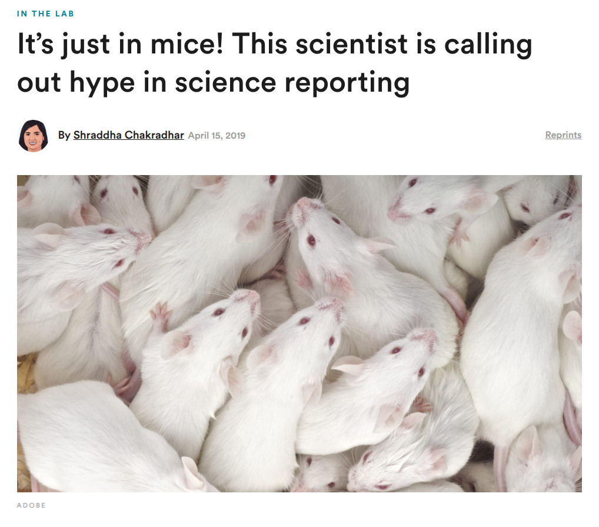{fig-align='center' width=800}

## Jon Snow and Cholera

{fig-align='center' width=400}

## John Snow and Cholera

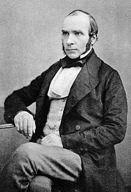{fig-align='center' width=400}

## John Snow and Cholera

::: {.incremental}

- In **1854**, there was an extreme outbreak of cholera in the area near Broad Street in London. 
  - Physician John Snow hypothesized that cholera was transmitted through the water rather than through the air (this was **before germ theory** was developed).
- Snow convinced the local authorities to remove the handle of the Broad Street water pump. Cholera deaths soon declined.
  - However, **is this enough** to infer that cholera was transmitted through the water?
- Even Snow didn't think so

  > There is no doubt that the mortality was much diminished, as I said before, by the flight of the population, which commenced soon after the outbreak; but the attacks had so far diminished before the use of the water was stopped, that it is impossible to decide whether the well still contained the cholera poison in an active state, or whether, from some cause, the water had become free from it.

- A before-and-after comparison might not be enough - other things are changing too!
  - People were already leaving (because of the *cholera*) - Fewer people = fewer deaths!
  
:::

## John Snow and Cholera

::: {.incremental}

- The **best** evidence for waterborne cholera came from a **later study** of Snow's
  - **1865** - "Cholera and the water supply in the south districts of London in 1854"
- Snow noticed that South London had two main water suppliers: **Lambeth Company** and **Southwark and Vauxhall Company**
  - Snow also observed two cholera outbreaks - one in **1849** and one in **1853**
  - Some time between those two years, **Lambeth Company** changed to a different, less-contaminated water source
  
    > Between the epidemics of 1849 and that of 1853, one of the water companies supplying the south districts of London changed its source of supply from the middle of the town, near the foot of the Hungerford Suspension Bridge, to Thames Ditton, at a part of the river which is beyond the influence of the tide, and, therefore, out of reach of the sewage of the metropolis.

:::

## John Snow and Cholera

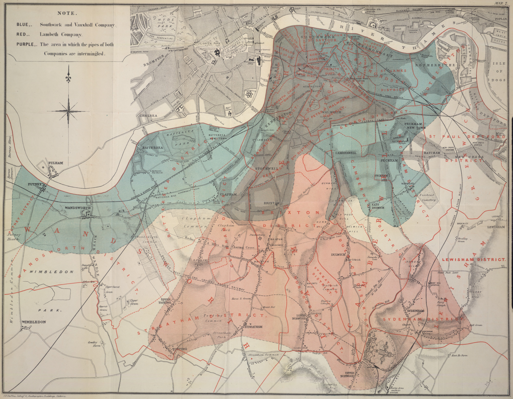{fig-align='center' width=800}

## John Snow and Cholera

::: {.incremental}

- He looked at cholera deaths in the **Southwark and Vauxhall**-supplied areas compared to the **Lambeth**-supplied areas

  > Taking into account the population supplied respectively by each company, the mortality was, at this period of the epidemic, **nearly eight times as great** in that supplied by the Southwark and Vauxhall Company as in that supplied by the Lambeth Company.
  
- But now, Snow could also look at **1849** when they both used the same source
  - If **Southwark and Vauxhall** also had 8x death rates in **1849** then it wouldn't be because of the water
  - It was the opposite! **Lambeth**-supplied areas were **worse off** before.
  
    > In the autumn of 1853 it was shown by Dr. Farr* that the districts partly supplied by this, the **Lambeth Water Company**, with improved water, suffered less than the districts supplied entirely by the Southwark and Vauxhall Company with the water from the river at Battersea Fields, although **in 1849 they had suffered rather more** than the latter districts
  

  
:::

## John Snow and Cholera

What made this work?

::: {.incremental}

1. **Clear and well-defined intervention** 
  - Snow was not vaguely learning about "water and cholera" - he was asking "What happens to cholera deaths if the main water supplier switches to a cleaner source?"
2. **Clear and well-defended assumptions**
  - Snow had already ruled out before-and-after comparisons (other things are changing!)
  - Snow also was skeptical of just a **cross-sectional** comparison (**Lambeth** areas might just be different)
  - **A more plausible assumption** - If there is **anything** different about the "treated" areas and the "control" areas that affects cholera deaths, then whatever that is should have the **same effect** in both 1849 and 1853
  - One of the earliest "differences-in-differences"
  
:::

## Be like John Snow

What makes this a good model for coming up with a compelling and **answerable** research question?

::: {.incremental}

1. **Deep substantive knowledge** - The best designs come from understanding the nuances of a particular case to figure out what variation is most useful.
2. **A story about the data generating process** - Why did Lambeth move to a different supplier?
3. **Thinking about alternative explanations** - Is there any factor that affects who gets the intervention that would also affect the outcome? How do we account for those?

:::

## Who comments on political YouTube?

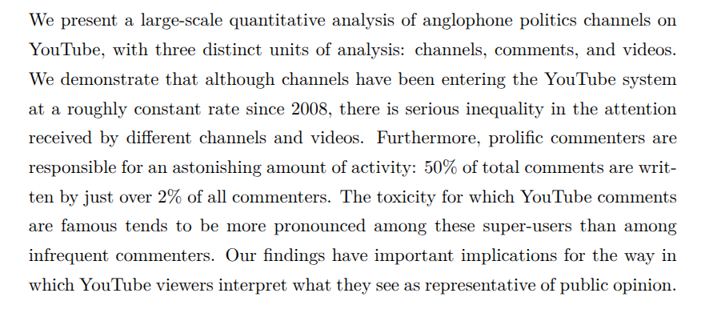{fig-align='center' width=800}

## Who comments on political YouTube?

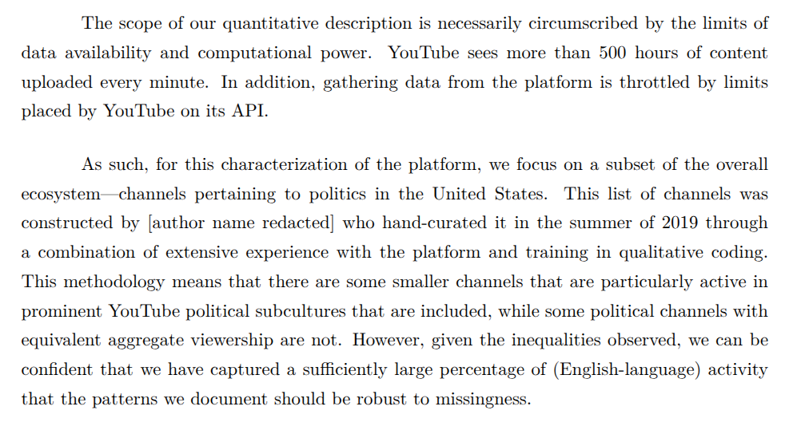{fig-align='center' width=800}

## Who comments on political YouTube?

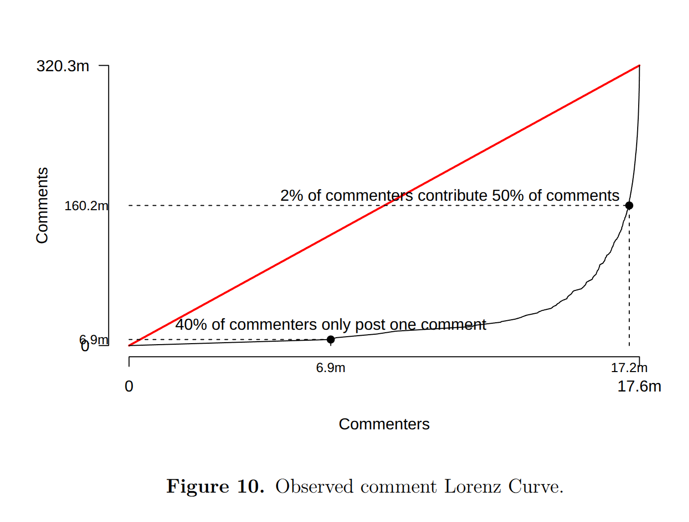{fig-align='center' width=800}

## Who comments on political YouTube?

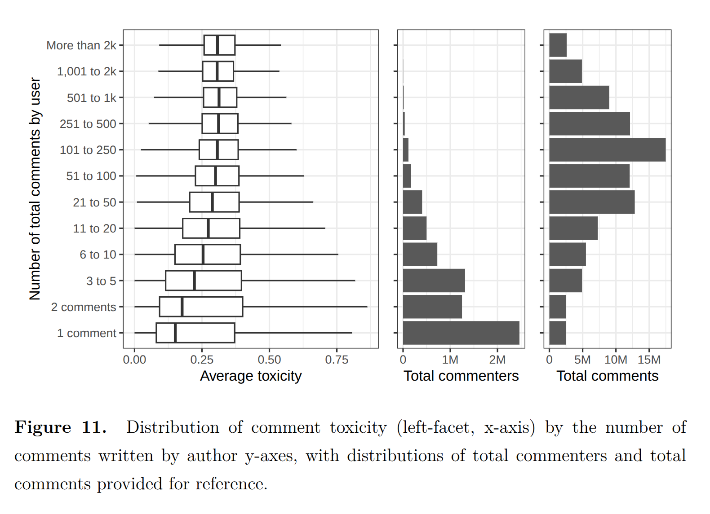{fig-align='center' width=800}

## Who comments on political YouTube?

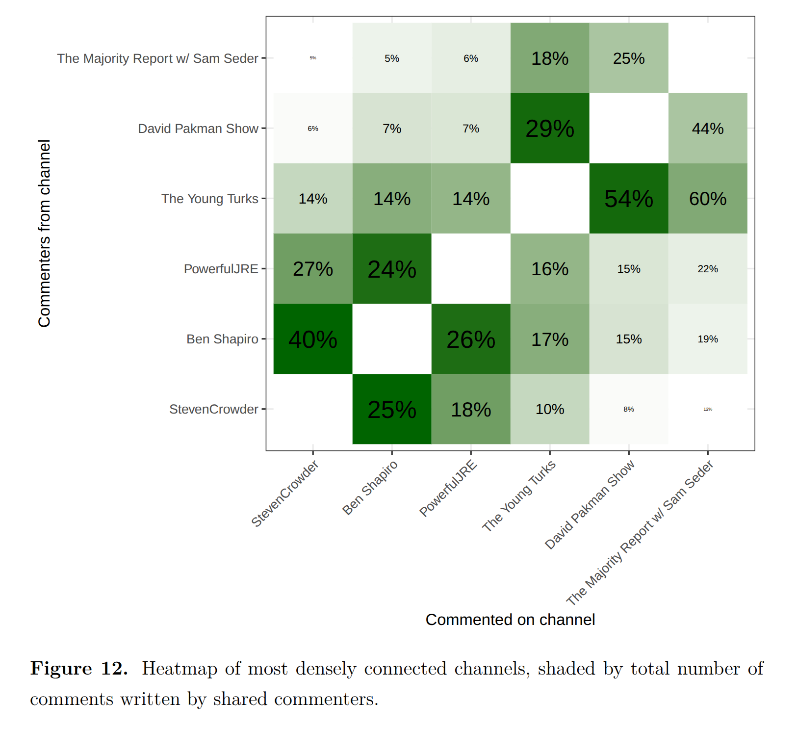{fig-align='center' width=800}

## "What" becomes "What if?"

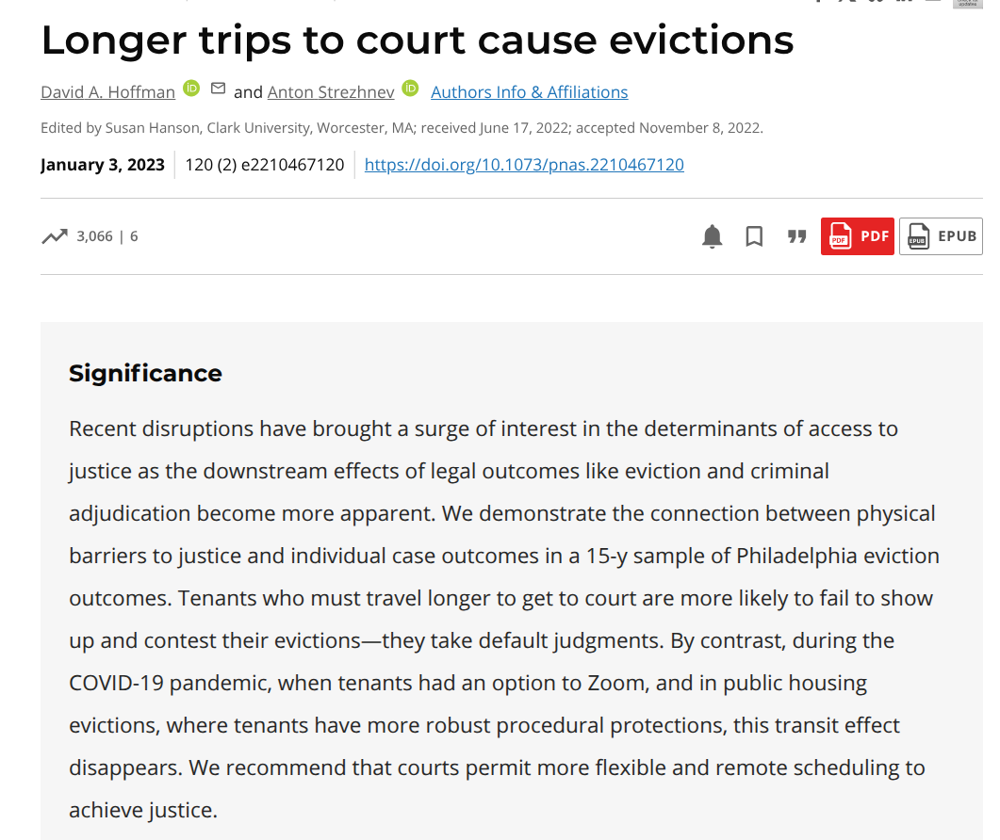{fig-align='center' width=800}

## "What" becomes "What if?"

{fig-align='center' width=800}

## "What" becomes "What if?"

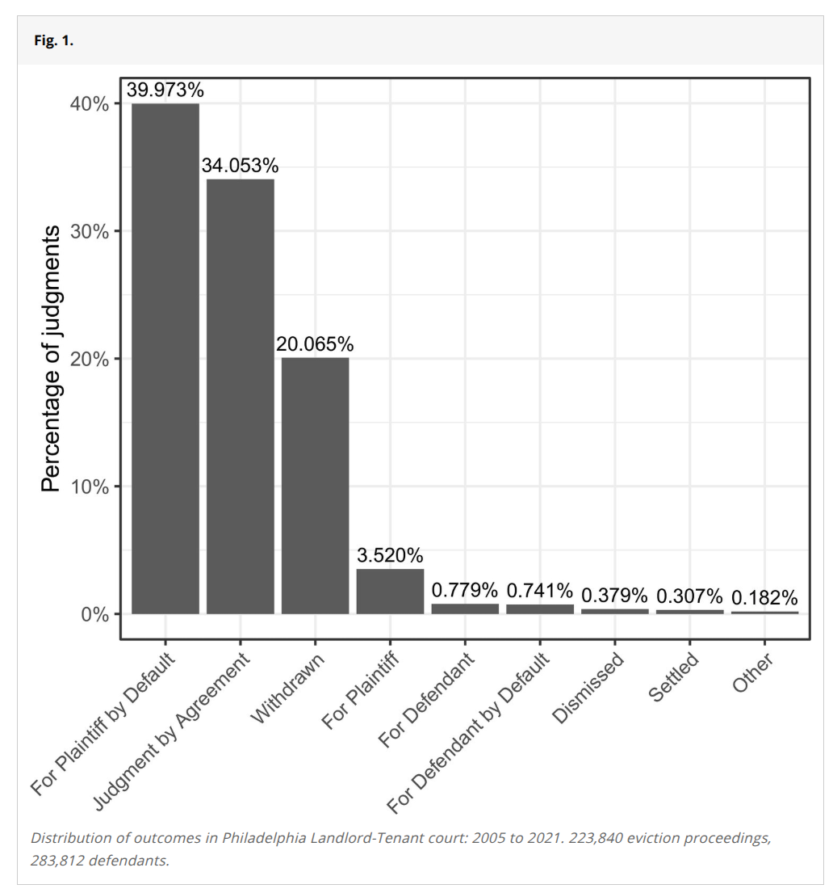{fig-align='center' width=800}

## "What" becomes "What if?"

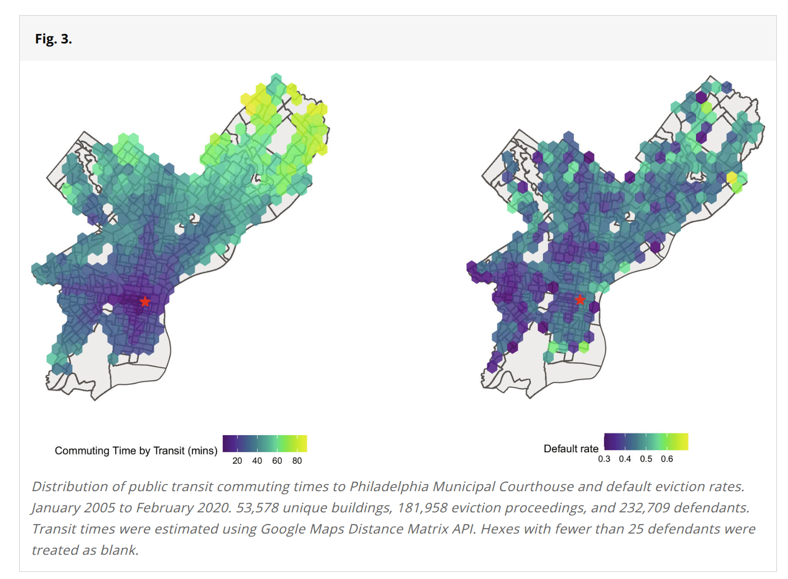{fig-align='center' width=800}

## "What" becomes "What if?"

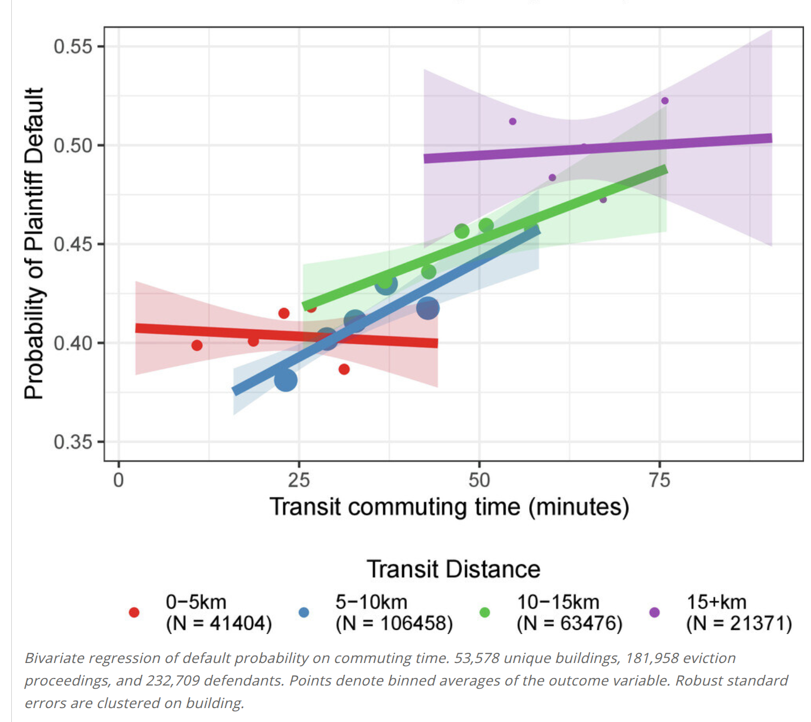{fig-align='center' width=800}

## Tell the story of the data!

- We tried to isolate as much as we could
  - Comparing demographically similar regions
  - Comparing places w/ similar *distance* but different *commuting times*
  - Finding "no effect" during Covid (b/c of remote hearings) or in public housing cases (b/c attorneys told us they're less strict)
- What **finally sold me** that this is real:
  - We got data from **Harris County, TX** (Houston + suburbs)
  - There's no good public transit here! Everyone drives!
- But...there's more than one courthouse! Many districts!
  - Each district has **two** courthouses.
  - And sometimes landlords in the same building filed in **different** courthouses.
  - So we compared tenants in the **same** building, **same** month, but different courthouses
  - And the effect **was still there!**

## Midterm exam

::: {.incremental}

- **Wednesday, October 7**, in person during the class period
  - Pen-and-paper, timed
  - Covers the first five weeks: probability theory
- Probability questions in the *context* of actual research settings
  - Focus on properties of conditional probability and properties of expectations
  - Expect both theory and practical analysis of sample code and results

:::

## Next week

::: {.incremental}

- Estimation
  - Estimators as functions of data: they are **random variables** too!
  - Sampling distributions
  - Bias, variance, and the mean squared error of an estimator

:::
