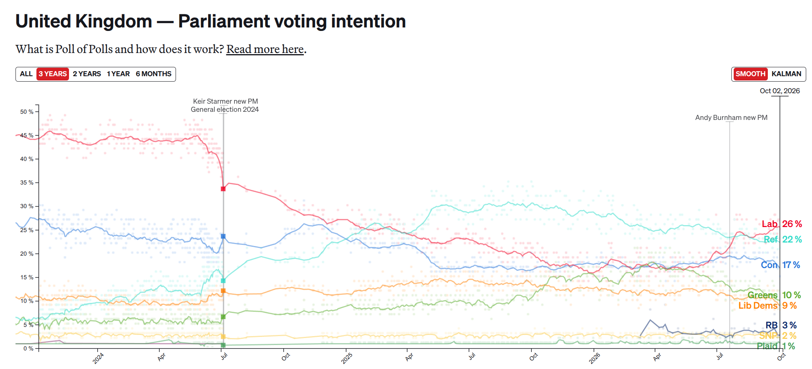

## Welcome back! {.title-slide}

<!-- MathJax macros for the whole deck. The reveal math plugin overwrites
     window.MathJax, so a header config would be clobbered; defining them in
     the first slide registers them before any later slide is typeset. The
     wrapper takes up no space and renders nothing. -->
::: {style="position:absolute;width:0;height:0;overflow:hidden;opacity:0"}
$$
\newcommand{\Var}{\text{Var}}
\newcommand{\Cov}{\text{Cov}}
\newcommand{\Corr}{\text{Corr}}
\newcommand{\indep}{\mathrel{\perp\mkern-10mu\perp}}
$$
:::

## Week overview

::: {.incremental}

- Last week
  - Joint and conditional distributions
  - Covariance and correlation
  - Conditional expectations and the best linear predictor
- This week
  - **What is a scientific theory for?**
  - What counts as an **explanation**? Models, interventions, mechanisms
  - **Asking a research question**: What is your estimand?
  - **Descriptive** versus **causal** questions
  - Connecting the theoretical estimand to an **empirical** estimand
- **Midterm** on Wednesday!

:::

## From theory to empirics

::: {.estimand-flow}

:::

::: {.attribution}
Adapted from @lundberg2021estimand, Fig. 1
:::

## One view of scientific theory

::: {.incremental}

- A theory consists of a set of **assumptions**...
- ...from which we deductively derive **propositions**...
- ...which have **testable implications**.

:::

## The hypothetico-deductive model

::: {.incremental}

1. Formulate a theory
2. Derive empirical implications
3. Test those implications 
4. If the implications hold, keep the theory. If they don't, change the theory.

:::

## The hypothetico-deductive model is a lie

1. Formulate a theory

   ::: {.fragment}
   - ...often *after* seeing the data.
   :::

2. Derive empirical implications

   ::: {.fragment}
   - ...which never follow from the theory alone
   :::

3. Test those implications

   ::: {.fragment}
   - ...with noisy data and probabilistic predictions
   :::

4. If the implications hold, keep the theory. If they don't, change the theory.

   ::: {.fragment}
   - ...passing doesn't prove the theory is true and failing doesn't tell you what to change
   :::

## The principle of "falsification"

{fig-align="center" width=500px}

## The principle of "falsification"

::: {.incremental}

- **Popper** [-@popper1959logic]: Theories cannot be proven **true** but they can be demonstrated to be **false**

  > "In so far as a scientific statement speaks about reality, it must be falsifiable; and in so far as it is not falsifiable, it does not speak about reality." [@popper1959logic]

- A scientific statement **sets the conditions** under which it could be demonstrated wrong.
  - Is there an experimental finding that would **contradict** a theory's predictions?
  
:::
  
## The problems with falsification alone

::: {.incremental}

- Let's consider a classic **political science** theory: **Duverger's Law** [@duverger1954political]
  - **Electoral systems** affect the **number of parties** in that system.

- **Plurality rule** in **single member district** elections $\leadsto$ **two parties**
  - **Proportional** systems lead to **many parties**

- What's the logic?
  - Voters don't want to waste their vote on a third party that has no chance of winning.

:::

## The problems with falsification alone

{fig-align="center" width=800}

## Research programmes

{fig-align="center" width=500}

## Research programmes

::: {.incremental}

- **Lakatos** [-@lakatos1970falsification]: A **middle ground** between falsificationism and methodological anarchy
- Science is not interested in just a single **theory** - science is built around research **programmes**
  - Democracy and autocracy
  - Voters and elections
  - Political economy
- Theories are built around a **core** of assumptions that are hard to challenge
  - (e.g. rational actor model)
- The core is surrounded by "auxiliary" hypotheses - more open to revision
  - (e.g. voters punish incumbents for bad economic outcomes)
- Findings that go against the theory lead to revisions of **auxiliary** hypotheses
  - (e.g. maybe different economic outcomes matter more - inflation vs. unemployment?)

:::

## Research programmes

::: {.incremental}

- **Productive** research programmes 
  - Revisions in the auxiliary hypotheses lead to changes in theories **that generate new, useful predictions**
- **Unproductive** research programmes keep having to add modifications just to stay afloat!

:::

## Back to Duverger's Law

::: {.incremental}

- Single-member systems don't consistently get two major parties - **Canada (the BQ), UK (Greens, Lib-Dems, Reform)**
  - Is Duverger's Law a **bad theory?** 
  - Or just in need of **refinement?** 
- Do we revise the auxiliary hypotheses
  - (e.g. Can strategic voters create systems with more than two parties under plurality/single member districts?)
- Or do we need to revise the core?
  - (e.g. Voters aren't strategic!)

:::

## Explaining the UK

{fig-align="center" width=800}

## Models don't have to be true

::: {.incremental}

- "All models are wrong, but some are useful" [@box1979robustness]. A model is a **representation**, for a purpose [@clarke2007modernizing; @clarke2012model]
  - Models serve many purposes beyond prediction.
  - They provide foundational **concepts**, they may articulate structural **constraints** on the world, they may try to **explain** some observed phenomenon.
- Some of the most important models have **no empirical test at all!**
  - **Arrow** [-@arrow1951social]: no voting rule satisfies Pareto efficiency, non-dictatorship, and independence of irrelevant alternatives
  - **Fearon** [-@fearon1995rationalist]: war is costly, so why can't rational states find a bargain both prefer?
  - What would it mean to "test" either of these? It's pointless: these are tools to **guide our thinking**

:::

## "Why does this happen?"

::: {.incremental}

- As social scientists, we don't just want to **predict**, we want to **explain**.
  - Why do wars happen?
  - Why do democracies collapse?
  - Why is American politics so polarized?
- But what counts as an **answer** to a why-question?
  - **Description** defines the terms of explanation, but it answers a "**What?**" question.
  - **Prediction** is a step forward, but it's also a "What?" - A **What will?** question.
  - A **model** gives us an interesting story, but why should we believe it?

:::

## From "why?" to "what if?"

::: {.incremental}

- One answer: an explanation tells you what **made the difference**
  - To explain is to answer "**what if things had been different?**" [@woodward2003making]
  - Would this country have gone to war if it were a democracy? Would turnout have been higher under same-day registration?
  - These are **causal** questions
- Causes are things you can **intervene** on
  - Whether the story behind the effect is "true" is besides the point.
  - "If you can spray them, then they are real" [@hacking1983representing]
- The quantity of interest is **an effect**: the consequence of a manipulable 'treatment' on a defined population
  - The theory's job is to **suggest** plausible manipulations to search over.

:::

## Theory as mechanism-explaining

::: {.incremental}

- But how do we know whether an effect in one setting **generalizes** to other settings?
  - This is often termed an "external validity" or "transportability" question.
  - Is the effect the same if we did the intervention tomorrow? Or in Sweden? Or in the real world and not a survey?
- The **empiricists'** answer: Just run more studies in more places!
- The **theorists'** rebuttal: You can run all the experiments you want, you won't know the **mechanism**
- **Theory and Credibility** [@ashworth2021theory] "'Why does this important thing happen?' has been replaced by 'What is the effect of $x$ on $y$?'" (p. 1)
  - "The essence of formal theory is the crafting of models that **embody mechanisms** and reveal the **all else equal implications** of those mechanisms" (p. 7)
  - "The essence of the credibility revolution is the crafting of research designs that make credible the claim to have **held all else equal**, at least on average" (p. 7)

:::

## Step 1: Set a target

::: {.estimand-flow .hl-1}

:::

::: {.attribution}
Adapted from @lundberg2021estimand, Fig. 1
:::

## What's your estimand?

>  Every quantitative study must be able to answer the question: **what is your estimand?** The estimand is the target quantity—the purpose of the statistical analysis. Much attention is already placed on how to do estimation; a similar degree of care should be given to defining the thing we are estimating. We advocate that authors **state the central quantity of each analysis**—the theoretical estimand—in precise terms that exist outside of any statistical model. In our framework, researchers do three things: (1) set a theoretical estimand, clearly connecting this quantity to theory; (2) **link to an empirical estimand**, which is informative about the theoretical estimand under some identification assumptions; and (3) **learn from data**. 

--- @lundberg2021estimand

## Types of empirical questions

::: {.incremental}

- **Descriptive** - **"What?"**
  - What is the share of U.S. Hispanic voters who voted for Donald Trump in 2024?
  - How many political posts on Facebook are false information?
  - What is the structure of the co-sponsorship network in the U.S. Congress?
  
- **Causal** - **What if?** ("Effects of Causes")
  - Does weakening central bank independence increase inflation?
  - Does changing an individual's news diet change their attitudes?
  - Does giving someone a guaranteed income affect their willingness to search for employment?
  
:::

## Estimands as population expectations

::: {.incremental}

- Many theoretical estimands in the social sciences can be articulated in terms of a **unit-specific quantity** plus a **target population** [@lundberg2021estimand]
  - Stated in terms that "exist outside of any statistical model" rather than as regression coefficients
- For **descriptive** estimands, a common target is the **expectation** of the individual level outcome measure $Y_i$ over some population distribution

  $$ \underbrace{\mathbb{E}}_{\substack{\text{average over the} \\ \text{target population}}} \big[\, \underbrace{Y_i}_{\text{unit-specific quantity}} \,\big] $$
  

:::

## Defining causal estimands

::: {.incremental}

- We need a language for talking about **what if?** questions - how do we articulate an estimand for a **causal** quantity?
  - Causation is about manipulation: If a treatment $D$ were changed, what would happen to $Y$?
- The **potential outcomes** framework [@rubin1974estimating]
  - Units $i$ in some population
  - A binary **treatment** $D_i \in \{0, 1\}$
  - An observed **outcome** $Y_i$
- The **potential outcome** $Y_i(d)$ is the value $Y_i$ would take if $D_i$ were **set** to $d$
  - $Y_i(1)$: the outcome if unit $i$ were treated
  - $Y_i(0)$: the outcome if unit $i$ were under control
  - Each unit has **both**. They are fixed attributes. 
  - "Potential" because we **only** get to see one.

:::

## Causal effects are contrasts in potential outcomes

::: {.incremental}

- The **individual** causal effect: $\tau_i = Y_i(1) - Y_i(0)$
- The **average treatment effect** (ATE): the same unit-specific quantity, averaged over a target population

  $$ \tau = \underbrace{\mathbb{E}}_{\substack{\text{average over the} \\ \text{target population}}} \big[\, \underbrace{Y_i(1) - Y_i(0)}_{\text{unit-specific causal effect}} \,\big] = \mathbb{E}[Y_i(1)] - \mathbb{E}[Y_i(0)]$$

- Changing the **target population** changes the estimand.
  - The **ATT**, the effect among those who were treated: $\mathbb{E}[Y_i(1) - Y_i(0) \mid D_i = 1]$
  - Conditional effects among women vs. men, among those who would comply with treatment...
- All of this exists **outside of any statistical model**. No regressions yet!

:::

## The fundamental problem of causal inference

- We only ever observe the potential outcome for the treatment that was **actually** received

  $$Y_i = Y_i(1)\, D_i + Y_i(0)\, (1 - D_i)$$

Unit  $i$  | Treatment  $D_i$  | $Y_i(1)$ | $Y_i(0)$ | Observed $Y_i$   |
:---------:|:-----------------:|:--------:|:--------:|:----------------:|
 $1$       |  $1$              |  $5$     |   ?      |    $5$           |
 $2$       |  $0$              |  ?       |  $-3$    |    $-3$          |
 $3$       |  $1$              |  $9$     |   ?      |    $9$           |
 $\vdots$  |   $\vdots$        |  $\vdots$| $\vdots$ |      $\vdots$    |
 $N$       |  $0$              |   ?      |   $8$    |   $8$            |

::: {.incremental}

- Half the table is **missing**, by construction. No $\tau_i$ is ever observed [@holland1986statistics]
- So the theoretical estimand $\mathbb{E}[Y_i(1)] - \mathbb{E}[Y_i(0)]$ is defined on quantities we **can't see**
- What assumptions can we make on the way the data is generated so that we **can** see it?

:::

## Step 2: Link to observable data

::: {.estimand-flow .hl-2}

:::

::: {.attribution}
Adapted from @lundberg2021estimand, Fig. 1
:::

## Causal Identification

::: {.incremental}

- The **theoretical** estimand is defined in terms of potential outcomes: $\tau = \mathbb{E}[Y_i(1)] - \mathbb{E}[Y_i(0)]$
- An **empirical** estimand is defined on things we observe. 
- One choice: The difference in conditional expectations between treated and control

  $$\mathbb{E}[Y_i \mid D_i = 1] - \mathbb{E}[Y_i \mid D_i = 0]$$

- **Identification**: under what assumptions about the world are these two the **same number**?
  - This comes *before* any question about estimation.
:::

## Causal Identification

::: {.incremental}

- We assume that $Y_i = Y_i(1)$ when $D_i = 1$ and $Y_i = Y_i(0)$ when $D_i = 0$:

  $$\mathbb{E}[Y_i \mid D_i = 1] - \mathbb{E}[Y_i \mid D_i = 0] = \mathbb{E}[Y_i(1) \mid D_i = 1] - \mathbb{E}[Y_i(0) \mid D_i = 0]$$

- And so the empirical estimand is equal to the treated group's $Y_i(1)$ minus the control group's $Y_i(0)$
  - This is a comparison of two causal quantities but it's **not on the same set** of units!

:::

## Selection bias

::: {.incremental}

- One way to think about the discrepancy is in terms of how the **difference-in-means** differs from the average treatment effect **on the treated**

  ::: {style="font-size: 0.85em"}
  $$\underbrace{\mathbb{E}[Y_i \mid D_i = 1] - \mathbb{E}[Y_i \mid D_i = 0]}_{\text{difference in means}} = \underbrace{\mathbb{E}[Y_i(1) - Y_i(0) \mid D_i = 1]}_{\text{ATT}} + \underbrace{\mathbb{E}[Y_i(0) \mid D_i = 1] - \mathbb{E}[Y_i(0) \mid D_i = 0]}_{\text{selection bias}}$$
  :::

- **Selection bias**: How different are the treated and control groups' outcomes **even without** treatment?

:::

## Ignorability

::: {.incremental}

- The assumption that makes the selection bias **zero**: treatment is independent of the potential outcomes

  $$\{Y_i(1), Y_i(0)\} \indep D_i$$

  - Also called **unconfoundedness**, **exogeneity**, "as-if random"
  - In words: treatment is not systematically more likely for units with higher (or lower) potential outcomes
- Then $\mathbb{E}[Y_i(0) \mid D_i = 1] = \mathbb{E}[Y_i(0) \mid D_i = 0]$, and the difference in means **identifies** the ATE

  $$\mathbb{E}[Y_i \mid D_i = 1] - \mathbb{E}[Y_i \mid D_i = 0] = \mathbb{E}[Y_i(1)] - \mathbb{E}[Y_i(0)]$$

- **Randomized experiments** make this true by design. 
  - In observational data it is an **assumption about the world**

:::

## Conditional ignorability

::: {.incremental}

- A weaker assumption states that treatment is as-if random **within** groups defined by observed covariates $X_i$

  $$\{Y_i(1), Y_i(0)\} \indep D_i \mid X_i \qquad\qquad 0 < P(D_i = 1 \mid X_i) < 1$$

  - "Selection on observables", "no unmeasured confounders"
- Then the **empirical estimand** is the average, over $X$, of the within-$X_i$ differences in means

  $$\tau = \mathbb{E}_X\Big[\, \mathbb{E}[Y_i \mid D_i = 1, X_i] - \mathbb{E}[Y_i \mid D_i = 0, X_i] \,\Big]$$

- This is what **assumptions** get us!
  - Which $X_i$? That's where we need theory and prior evidence to guide our 

:::

## Identification vs. estimation

::: {.incremental}

- **Identification** assumptions: what must be true of the **world** for an observable quantity to equal the estimand
  - Ignorability, conditional ignorability, consistency, positivity
  - Determined by argument, research design and **substantive knowledge**
- **Estimation** assumptions: what we need to learn that observable quantity from a **finite sample**
  - $\mathbb{E}[Y_i \mid D_i = 1, X_i]$ is a population quantity. We have $N$ observations, and maybe few at each value of $X_i$
  - Linearity, functional form, smoothness, etc... - this is where the statistics comes in
- Incorrect estimation assumptions add bias **even if** identification holds. 
  - But getting identification wrong means no amount of fancy stats can save you.

:::

## Step 3: Learn from data

::: {.estimand-flow .hl-3}

:::

::: {.attribution}
Adapted from @lundberg2021estimand, Fig. 1
:::

## Next week

::: {.incremental}

- **Step 3**: Learning from the data!
  - Where does the randomness come from?
  - Estimators as functions of data: they are **random variables**!
  - Sampling distributions
  - Bias, variance and other properties of an estimator.

:::

## References {.refs-slide}

::: {#refs}
:::
